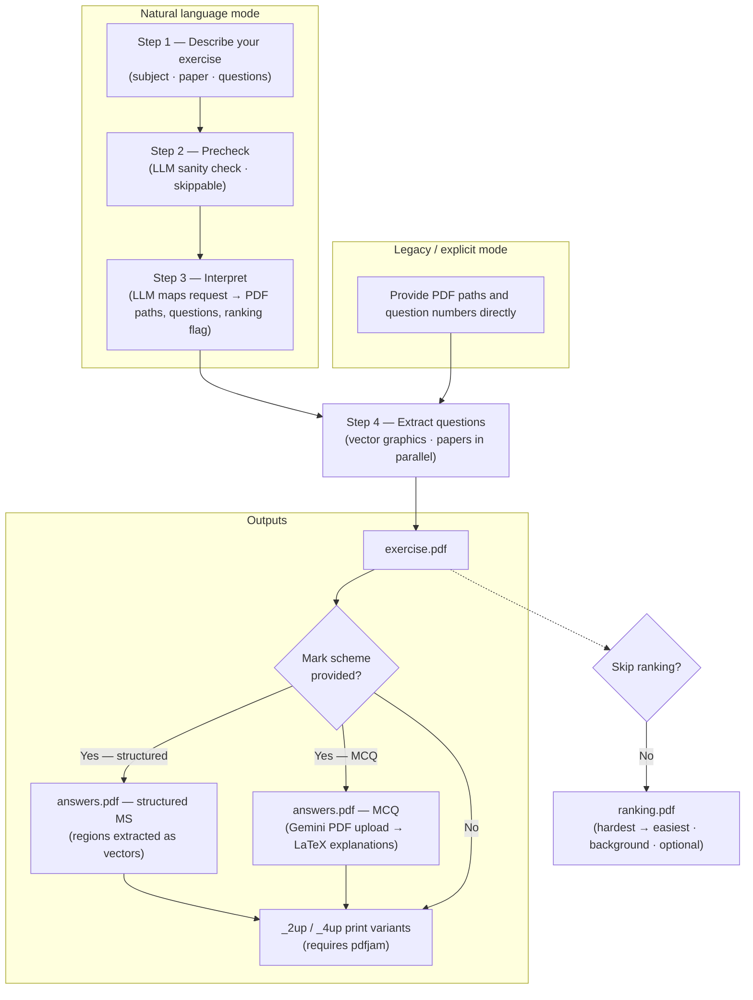

# eXercise

**Version 0.5**


Two pipelines for Cambridge-style IGCSE exam workflows. **eXercise** assembles printable practice sheets from bundled question papers — you describe the run in plain English, an LLM resolves it to PDF paths and question numbers, and the app extracts question regions as vector graphics, optionally attaches mark-scheme answers, generates MCQ explanations, and ranks by difficulty. **xScore** marks scanned student exams: it cleans the scan, identifies students, parses the mark scheme, runs an AI vision model over each page, and emits per-student PDF reports plus a class summary. Both pipelines share a FastAPI web UI (Generate / Grade / Library) and the same multi-provider AI client (Gemini, Qwen, Grok).

---

## What you get

- **Natural language** — one sentence picks subject, session, paper, and question numbers; an LLM maps it to PDFs in your `exams/` folders.
- **Legacy CLI** — point at any QP PDF, list question numbers, optional mark scheme path.
- **Web UI** — three pages: **Generate** (exercise builder with PDF preview and zoom), **Grade** (scan cleaner), and **Library** (browse/download bundled papers).
- **PDF preview** — continuous-scroll in-browser render with Ctrl-wheel zoom; tabs for exercise, answers, 2-up, 4-up, and ranking variants; jump-to-question overview panel.
- **Outputs** — exercise PDF, optional answers PDF, optional 2-up/4-up print variants (`pdfjam`), and an LLM-generated difficulty ranking PDF.
- **Grading** — upload student scan(s) + optional roster; the pipeline auto-rotates, deskews, and removes blank pages, returning a clean PDF.
- **Library** — browse and download the bundled IGCSE papers by subject, year, and session directly from the web UI.

---

## Contents

- [How exercise generation works](#how-exercise-generation-works)
- [How grading works](#how-grading-works)
- [Requirements](#requirements)
- [Quick setup](#quick-setup)
- [Usage](#usage)
- [Configuration](#configuration)
- [Docker](#docker)
- [Output](#output)
- [Project layout](#project-layout)

---

## How exercise generation works

Overview (rendered on GitHub as a diagram):



### Natural language mode (one sentence)

1. **You describe the run** — subject, which paper(s), which question numbers, and whether you want mark-scheme material. This is the same idea in the CLI (one quoted argument) or in the web **Generate** page.

2. **Optional precheck** — a small LLM call checks that your text mentions a supported subject and enough detail to identify a paper (unless you turn precheck off in config).

3. **Main interpretation** — the LLM sees the list of real PDF filenames in your exam folders and returns structured data: which question paper(s) to open, which question numbers, output filename, matching mark scheme files when they exist, and a `ranking` flag (defaults to `true`; set to `false` by saying "no ranking" in your request).

4. **Cut questions from the PDFs** — all question papers are opened in parallel; for each, the program finds where each question sits on the page and extracts those regions as vector graphics (not screenshots), preserving crisp text and diagrams.

5. **Build the exercise PDF** — all extracted strips are combined into **one continuous PDF** (your exercise sheet), with layout and headers appropriate to the subject.

6. **Answers PDF (if a mark scheme is available)** — the matching mark scheme is opened. For typical structured MS layouts, answer regions are extracted the same way as questions. For **MCQ** mark schemes, the tool uploads the question-paper PDF directly to the **Gemini Files API** (one call per batch of papers) and receives short 3-bullet explanations for each question, which are compiled into LaTeX; if `pdflatex` or the Gemini key is missing, it falls back to plain answer lines.

7. **Optional n-up copies** — if `pdfjam` is installed, **2-up** and **4-up** versions of the exercise (and answers) may be generated for printing.

8. **Difficulty ranking (background, optional)** — a second LLM job reads the assembled exercise as images and returns a ranked list of every question part from hardest to easiest. The result is compiled into `*_ranking.pdf` and appears as an extra tab in the web UI once ready. Requires `pdflatex`. Skipped if: the NL request contains "no ranking" / "skip ranking" (sets `ranking: false`), `RANKING_SKIP=true` is set in the environment, or `pdflatex` is not installed.

### Legacy mode (explicit paths)

1. You pass **question paper path**, **output path**, and **question numbers** (and optionally `--ms` with a mark scheme path).

2. Steps **4–8** above run the same way — there is **no** LLM step; the program goes straight to finding questions and building PDFs.

---

## How grading works

All four input files are required:

- **scan PDF** — the class exam scan (e.g. `scan.pdf`)
- **student roster** — `StudentList.xlsx` / `.csv` / `.pdf`
- **empty exam PDF** — blank exam template (`empty_exam.pdf`)
- **mark scheme PDF** — answer key (`answer_sheet.pdf`)

```mermaid
flowchart TD
    subgraph uploads ["Inputs (all required)"]
        direction LR
        u1[exam scan PDF]
        u2[student roster]
        u3[exam PDF]
        u4[mark scheme PDF]
    end

    s1["Step 1 —\nInterpret prompt\n(Gemini ·\nINTERPRET_PROMPT_MODEL)"]
    s2["Step 2 —\nSelect exam folder\n(terminal only ·\nfuzzy search)"]
    s3["Step 3 —\nRead student list\n(Gemini ·\nREAD_STUDENT_LIST_MODEL)"]
    routeCond{"Terminal or\nweb route?"}

    subgraph cleaning ["Scan cleaning (steps 4–7)"]
        direction TB
        s4["Step 4 —\nMerge duplex scans\n(optional · only when\ntwo scan files exist)"]
        s5["Step 5 —\nDetect white pages\nin scanned exam\n(parallel ·\n≤ 4 CPU workers)"]
        s6["Step 6 —\nAutorotate scanned\nexam pages"]
        s7["Step 7 —\nDeskew scanned pages\n(IGCSE anchor\ndetection · parallel)"]
        s4 -.->|if two scans| s5
        s5 --> s6 --> s7
    end

    subgraph geometry ["Exam geometry (steps 8–15)"]
        direction TB
        s8["Step 8 —\nDetect empty\nexam geometry\n(scan÷exam pages →\nnum_students ·\nroster cross-check)"]
        s9["Step 9 —\nDetect cover page\nin empty exam\n(EMPTY_EXAM_COVER_MODEL)"]
        s10["Step 10 —\nDetect cover pages\nin scanned exam\n(COVER_PAGE_DETECTION_MODEL)"]
        s11["Step 11 —\nDetect student names\n(NAME_DETECTION_MODEL\n· parallel)"]
        s12["Step 12 —\nCheck number of pages\nper student\n(abort if mismatch)"]
        s13["Step 13 —\nCheck page order\n(PAGE_ORDER_CHECK_MODEL)"]
        s14["Step 14 —\nDetect blank pages\nin empty exam\n(text only ·\n14_EXAM_BLANK_DETECTION_MODEL)"]
        s15["Step 15 —\nCheck student handwriting\non blank pages\n(vision · parallel ·\n15_HANDWRITING_CHECK_MODEL)"]
        s8 --> s9 --> s10 --> s11 --> s12 --> s13 --> s14 --> s15
    end

    subgraph scaffold ["Exam scaffold (steps 16–22)"]
        direction TB
        s16["Step 16 —\nDetect empty\nexam layout\n(DETECT_LAYOUT_MODEL)"]
        s17["Step 17 —\nCut empty exam\n(1×1 → skipped ·\nmulti-up →\nsplit sub-pages)"]
        s18["Step 18 —\nParse empty exam PDF\n(READ_EXAM_PDF_MODEL)\n(Gemini: native PDF\n· Qwen: per-page PNG)"]
        s19["Step 19 —\nDetect mark scheme\ngraphics\n(DETECT_SCHEME_GRAPHICS_MODEL\n· PNG only)"]
        s20["Step 20 —\nAssign questions\nto mark scheme pages\n(ASSIGN_SCHEME_QUESTIONS_MODEL\n· Gemini: native PDF\n· Qwen: per-page PNG)"]
        s21["Step 21 —\nParse mark scheme\n(READ_MARK_SCHEME_MODEL)\n(Gemini: native PDF\n· Qwen: per-page PNG)"]
        s22["Step 22 —\nBuild grading\nscaffold\n(merges question tree\n+ mark scheme)"]
        s16 --> s17 --> s18 --> s19 --> s20 --> s21 --> s22
    end

    subgraph marking ["AI marking (steps 23–24)"]
        direction TB
        s23["Step 23 —\nBuild AI marking\nblueprints\n(per-page templates\nfrom scaffold)"]
        s24["Step 24 —\nRun AI marking\n(MARKING_MODEL ·\nMARKING_WORKERS\nparallel)\n(Gemini: native PDF\n· Qwen: per-page JPEG)"]
        s23 --> s24
    end

    subgraph reports ["Reports (steps 25–29)"]
        direction TB
        s25["Step 25 —\nFuse AI marking\noutput to\nstudent reports\n(merge per-page marks\n· cross-page max)"]
        s26["Step 26 —\nCompute class\nstatistics + curve\n(per-question averages\n· grade distribution)"]
        s27["Step 27 —\nGenerate per-student\nreports\n(landscape + portrait\n+ 2UP · xelatex ·\nMARKING_WORKERS\nparallel)"]
        s28["Step 28 —\nGenerate class report"]
        s29["Step 29 —\nBuild review queue\n(low-confidence marks\nfor manual review)"]
        s25 --> s26 --> s27 --> s28 --> s29
    end

    subgraph summary ["Summary (steps 30–32)"]
        direction TB
        s30["Step 30 —\nSummarise step\ntimings\n(wall-clock per phase\n· API call counts)"]
        s31["Step 31 —\nEvaluate marking\naccuracy\n(vs ground truth\nif available)"]
        s32["Step 32 —\nSummarise AI costs\n(token counts ·\nRMB cost per model)"]
        s30 --> s31 --> s32
    end

    bg["Pre-render scan pages\n(background thread ·\nMARKING_WORKERS)"]

    uploads --> s1
    s1 --> routeCond
    routeCond -->|terminal| s2 --> s3
    routeCond -->|web| s3
    s3 --> cleaning --> geometry --> scaffold --> marking --> reports --> summary
    s11 -.->|kicks off| bg
    bg -.->|images ready| s24
```



Same pipeline as a flat sequence — step-by-step from 1 to 32:

```mermaid
flowchart TD
    subgraph setup["Setup (1–3)"]
        s1["1 — Interpret prompt"] --> s2["2 — Select exam folder"] --> s3["3 — Read student list"]
    end
    subgraph scan["Scan cleaning (4–7)"]
        s4["4 — Merge duplex scans"] --> s5["5 — Detect blank pages"] --> s6["6 — Autorotate"] --> s7["7 — Deskew"]
    end
    subgraph geometry["Geometry & validation (8–15)"]
        s8["8 — Exam geometry"] --> s9["9 — Cover page (empty exam)"] --> s10["10 — Cover pages (scan)"] --> s11["11 — Student names"] --> s12["12 — Page count check"] --> s13["13 — Page order check"] --> s14["14 — Blank pages (empty exam)"] --> s15["15 — Student handwriting check"]
    end
    subgraph scaffold["Exam scaffold (16–22)"]
        s16["16 — Detect exam layout"] --> s17["17 — Cut empty exam"] --> s18["18 — Parse empty exam PDF"] --> s19["19 — Mark scheme graphics"] --> s20["20 — Assign questions to scheme pages"] --> s21["21 — Parse mark scheme"] --> s22["22 — Build grading scaffold"]
    end
    subgraph marking["AI marking (23–24)"]
        s23["23 — Build marking blueprints"] --> s24["24 — Run AI marking"]
    end
    subgraph reports["Reports (25–29)"]
        s25["25 — Fuse marks to reports"] --> s26["26 — Class stats & curve"] --> s27["27 — Per-student PDFs"] --> s28["28 — Class report"] --> s29["29 — Review queue"]
    end
    subgraph summary["Summary (30–32)"]
        s30["30 — Timing summary"] --> s31["31 — Accuracy evaluation"] --> s32["32 — AI cost summary"]
    end

    s3 --> s4
    s7 --> s8
    s15 --> s16
    s22 --> s23
    s24 --> s25
    s29 --> s30
```



**Steps (1–32):**

**Setup (1–3)**
- 1 — Interpret prompt
- 2 — Select exam folder
- 3 — Read student list

**Scan cleaning (4–7)**
- 4 — Merge duplex scans
- 5 — Detect white pages in scanned exam
- 6 — Autorotate scanned exam pages
- 7 — Deskew scanned pages

**Geometry & validation (8–15)**
- 8 — Detect empty exam geometry
- 9 — Detect cover page in empty exam
- 10 — Detect cover pages in scanned exam
- 11 — Detect student names
- 12 — Check number of pages per student
- 13 — Check page order
- 14 — Detect blank pages in empty exam (text only)
- 15 — Check student handwriting on blank pages (vision)

**Exam scaffold (16–22)**
- 16 — Detect empty exam layout
- 17 — Cut empty exam
- 18 — Parse empty exam PDF
- 19 — Detect mark scheme graphics
- 20 — Assign questions to mark scheme pages
- 21 — Parse mark scheme
- 22 — Build grading scaffold

**AI marking (23–24)**
- 23 — Build AI marking blueprints
- 24 — Run AI marking

**Reports (25–29)**
- 25 — Fuse AI marking output to student reports
- 26 — Compute class statistics + curve
- 27 — Generate per-student reports (landscape + portrait + 2UP)
- 28 — Generate class report
- 29 — Build review queue

**Summary (30–32)**
- 30 — Summarise step timings
- 31 — Evaluate marking accuracy
- 32 — Summarise AI costs

The pipeline is **sequential at the orchestration level**. The only true concurrency is (a) a background thread that pre-renders all scan pages to JPEG starting just after step 11 — so step 24 doesn't block on rasterisation — (b) `MARKING_WORKERS` parallelism *inside* steps 24 (one API call per student page) and 27 (one xelatex process per student PDF), and (c) per-step `*_WORKERS` env vars for the parallel sites in steps 10, 13, 15, 19, 20, and 21 (each fans out one task per LLM call on a `ThreadPoolExecutor`; defaults are uncapped via `default.env`).

**Blank-page data flow (steps 14 → 15 → 24).** Step 14 identifies which exam pages are blank; only step 15 reads that artifact. Step 15 then runs a per-student vision check on each scan page that corresponds to a blank exam page and records, per student, which scan pages have handwriting (and which were inconclusive). Step 24 (AI marking) reads only step 15's `handwriting.json`: scan pages flagged no-handwriting are dropped from the marking work (no API call), and scan pages flagged with handwriting + an `attach_to_scan_page` link are appended as continuation images on the parent page's API call. Steps 16–23 do not touch either artifact.

Each run writes one folder per step under `output/xscore/<exam>/<timestamp>/`, named `NN_step_name/` (e.g. `07_deskew/`, `24_ai_marking/`). This layout is what `--resume-dir` reads from — see [Usage](#usage) for partial-run flags.

### Per-step details (1–32)

| Step | Description |
|------|-------------|
| **Setup (1–3)** | |
| **1 — Interpret prompt** | • Parses any free-text grading prompt into structured config (DPI, task type, student filter)<br>• Configure with `INTERPRET_PROMPT_MODEL` in `default.env` |
| **2 — Select exam folder** | • Terminal route only — skipped on the web route<br>• Fuzzy folder search locates the exam folder from the prompt hint or `--folder` flag |
| **3 — Read student list** | • Reads `StudentList.*` from the exam folder (`.xlsx`, `.xls`, `.csv`, `.pdf` via Gemini)<br>• Writes `03_read_student_list/students.json` and `students.md`<br>• Configure with `READ_STUDENT_LIST_MODEL` |
| **Scan cleaning (4–7)** | |
| **4 — Merge duplex scans** *(optional)* | • Only when two scan PDFs are found (duplex split into front-pages and back-pages files)<br>• Interleaves the two files into a single combined scan<br>• Skipped when a single scan file is present |
| **5 — Detect white pages in scanned exam** | • Low-resolution (72 DPI) pass classifies each page as blank or content<br>• Blank pages are dropped<br>• Runs in parallel (up to `min(4, cpu_count)` threads) |
| **6 — Autorotate scanned exam pages** | • Applies each page's PDF `/Rotate` metadata so encoded rotation becomes portrait<br>• Optional Tesseract OSD pass for extra correction |
| **7 — Deskew scanned pages** | • Detects IGCSE header anchors on each page (parallel)<br>• Anchor positions drive a fine deskew transform<br>• Corrected pages written to `07_deskew/cleaned_scan.pdf` |
| **Geometry & validation (8–15)** | |
| **8 — Detect empty exam geometry** | • `scan_pages ÷ exam_pages` computes `num_students`<br>• Cross-checked against the roster; mismatch is a warning, not an error<br>• Writes `08_exam_geometry/exam_geometry.json` |
| **9 — Detect cover page in empty exam** | • Checks page 1 of the empty exam PDF for a cover page (`EMPTY_EXAM_COVER_MODEL`)<br>• Informational; sets `empty_exam_has_cover` for blank-page detection<br>• Non-fatal: network errors are logged; pipeline continues<br>• Writes prompt artifacts to `09_cover_page/` |
| **10 — Detect cover pages in scanned exam** | • Checks scan page 1 for a cover page (`COVER_PAGE_DETECTION_MODEL`); if detected, verifies each expected cover position in parallel<br>• Result is authoritative and drives cover-page mode in all downstream steps<br>• Non-fatal: if `GEMINI_API_KEY` is not set, detection is skipped (standard mode assumed)<br>• Writes prompt artifacts to `10_cover_page_scan/` |
| **11 — Detect student names** | • Renders scan pages at `NAME_RECOGNITION_DPI` (300 DPI)<br>• Detects student names on the first scan page of each student block (`NAME_DETECTION_MODEL`)<br>• Fuzzy-matches names against the roster<br>• Writes `11_student_names/exam_student_list.json` / `.md`<br>• Immediately starts pre-rendering all scan pages to JPEG in a background thread |
| **12 — Check number of pages per student** | • Validates each student's page count against the expected `exam_pages (+ 1 cover)`<br>• Aborts with `SystemExit(1)` on mismatch, printing a per-student breakdown |
| **13 — Check page order** | • Verifies printed question text on each scan page is in the correct order (`PAGE_ORDER_CHECK_MODEL`)<br>• Non-fatal: exceptions are caught and logged<br>• Writes text artifacts to `13_page_order/` |
| **14 — Detect blank pages in empty exam** | • Text-only LLM call: identifies blank exam pages in the empty exam PDF (no question text — only writing lines or "BLANK PAGE" heading)<br>• Configure with `14_EXAM_BLANK_DETECTION_MODEL`<br>• Non-fatal; writes `14_exam_blank_detection/blank_exam_pages.json` |
| **15 — Check student handwriting on blank pages** | • Vision LLM call per (student × blank exam page): checks the corresponding student scan page for handwriting<br>• Reads step 14's `blank_exam_pages.json`; runs the per-task vision calls on a `ThreadPoolExecutor` (worker count from `HANDWRITING_WORKERS`, default 500)<br>• Pages with no handwriting are flagged as skip pages and consumed by step 24; inconclusive pages are surfaced separately and excluded from skip<br>• Configure with `HANDWRITING_CHECK_MODEL`<br>• Non-fatal; writes `15_student_handwriting/handwriting.json` and per-page JPEG images |
| **Exam scaffold (16–22)** | |
| **16 — Detect empty exam layout** | • AI vision call detects the printing layout of the exam PDF (1×1, 2-up, 4-up) (`DETECT_LAYOUT_MODEL`)<br>• Writes `16_detect_exam_layout/exam_layout.json` + `.md` |
| **17 — Cut empty exam** | • Pure geometry step — no AI call<br>• 1×1 layout: prints "skipped" and continues immediately<br>• Multi-up: crops and reassembles each physical page into one PDF page per sub-page in reading order<br>• Split PDF saved to `17_cut_exam/split_exam.pdf` |
| **18 — Parse empty exam PDF** | • Reads the exam PDF and extracts every question and sub-question<br>• Returns number, type, marks, page, subpage position, and answer options<br>• Writes `18_parse_exam_pdf/exam_questions.json` + `.md`<br>• Configure with `READ_EXAM_PDF_MODEL` (Gemini or Qwen) |
| **19 — Detect mark scheme graphics** | • Detects graphics (diagrams, tables) on each mark scheme page; crops bounding boxes to `19_detect_mark_scheme_graphics/` (`DETECT_SCHEME_GRAPHICS_MODEL`; skipped when not set) |
| **20 — Assign questions to mark scheme pages** | • Cheap per-page vision call asks which question numbers' criteria appear on each mark scheme page (`ASSIGN_SCHEME_QUESTIONS_MODEL`; Gemini → PDF upload, Qwen → PNG)<br>• Step 21 then sends only the relevant questions per page instead of the full scaffold — fewer hallucinations on pages with 1–3 of N questions<br>• Writes `20_assign_scheme_questions/questions_per_page.json`<br>• Skipped when env var is unset → step 21 falls back to full-scaffold behaviour |
| **21 — Parse mark scheme** | • Reads the mark scheme and returns correct answers and marking criteria (`READ_MARK_SCHEME_MODEL`)<br>• Per-page scaffold is filtered by step 20's mapping (or full scaffold when step 20 was skipped)<br>• Writes `21_parse_mark_scheme/mark_scheme.json` + `.md` |
| **22 — Build grading scaffold** | • Merges the exam question tree with mark scheme annotations<br>• Writes `22_create_report/report.json` / `.xml` + `.md` and `short_report.*`<br>• Runs even without a mark scheme (exam-only report)<br>• Drives the marking blueprints and AI marking |
| **AI marking (23–24)** | |
| **23 — Build AI marking blueprints** | • Extracts leaf questions from the scaffold for each exam page<br>• Writes per-page blueprints to `23_ai_marking_blueprints/blueprint_page_N.*`<br>• Includes subpage coordinates and page layout for the vision model |
| **24 — Run AI marking** | • Sends each student's scan pages to the vision model (one API call per page)<br>• Page images pre-rendered after step 11 — no rendering wait at API call time<br>• Model fills in `student_answer`, `assigned_marks`, and `explanation` for every question<br>• All pages run in parallel (`MARKING_WORKERS` threads); results written to `24_ai_marking/students/`<br>• Requires `DASHSCOPE_API_KEY` (or the provider matching `MARKING_MODEL`) |
| **Reports (25–29)** | |
| **25 — Fuse AI marking output to student reports** | • Merges per-page results into one record per student (cross-page questions: takes max marks)<br>• Writes `.json` and `.md` per student to `25_student_reports/students/`<br>• No PDF compile yet — that's step 27 |
| **26 — Compute class statistics + curve** | • Aggregates per-question averages across the class and produces a grade-distribution curve<br>• Writes `26_class_stats/class_stats.json` and `.md` |
| **27 — Generate per-student reports (landscape + portrait + 2UP)** | • Compiles each per-student report to PDF via `xelatex`<br>• Runs in parallel (`MARKING_WORKERS` processes); requires `xelatex`<br>• Outputs to `27_student_pdfs/` |
| **28 — Generate class report** | • Compiles the class-wide PDF (per-question averages, grade curve, combined student marks)<br>• Writes `28_class_report/class_report.pdf` |
| **29 — Build review queue** | • Extracts low-confidence or flagged marks into a manual-review queue<br>• Writes `29_review_queue/review.json` and `.md` |
| **Summary (30–32)** | |
| **30 — Summarise step timings** | • Wall-clock durations per pipeline phase + API call counts<br>• Writes `30_timing_summary/timing.json` and `timing.md` |
| **31 — Evaluate marking accuracy** | • Evaluates marking accuracy against ground truth when present<br>• Writes `31_accuracy/accuracy.json` |
| **32 — Summarise AI costs** | • Computes token counts and RMB cost per model from `AI API costs.xlsx`<br>• Writes `32_ai_costs/` with the per-model cost breakdown |

---

## Requirements

| | |
|---|---|
| **Python** | 3.10+ (3.12+ recommended) |
| **Python deps** | `pip install -r requirements.txt` |
| **Exam PDFs** | Under `exams/physics/`, `exams/computer_science/`, `exams/mathematics/` (see [`exams/README.md`](exams/README.md)). Paths are configurable in `eXercise/config.py`. |
| **LLM** | For natural-language mode and MCQ explanations: an API key for at least one provider below (see [Configuration](#configuration)). |

### Optional system tools

If missing, the app still runs; some features are skipped or simplified.

| Feature | Needs |
|--------|--------|
| **MCQ explanations** (nice PDF blocks) | `pdflatex` + TeX packages used in `eXercise/mcq_explanations.py` |
| **2-up / 4-up sheets** | `pdfjam` on `PATH` (e.g. Debian/Ubuntu: `texlive-extra-utils`) |
| **Difficulty ranking** | `pdflatex` (same as above); set `RANKING_SKIP=true` to disable |

**Ubuntu example:**

```bash
sudo apt update
sudo apt install -y texlive-latex-extra texlive-fonts-extra texlive-extra-utils
```

The **Dockerfile** installs TeX packages so containers get `pdflatex` and `pdfjam` without extra host setup.

### Grade page (optional)

The **Grade** page depends on the `xscore` package (not in `requirements.txt`) and API keys for the models it uses:

| | |
|---|---|
| `xscore` | Install separately if you want the scan-cleaning and AI-marking pipeline |
| `GEMINI_API_KEY` | Required for any step whose model is a Gemini model (`GOOGLE_API_KEY` accepted as fallback). With the shipped defaults that's steps 18 (parse exam PDF) and 20 (parse mark scheme). Other steps fall back to Gemini if their `*_MODEL` env var is set to a Gemini model. |
| `DASHSCOPE_API_KEY` | Required for any step whose model is a Qwen model (DashScope). With the shipped defaults that's steps 1, 3, 9, 10, 11, 13, 14, 15, 16, 19, and 23. Switch any of these to Gemini in `default.env` and the key becomes optional. |

If `xscore` is not installed, the rest of the app runs normally — only `/grade` will return errors.

---

## Quick setup

```bash
cd "/path/to/eXercise"
python3 -m venv .venv
source .venv/bin/activate          # Windows: .venv\Scripts\activate
pip install -r requirements.txt
```

Copy `.env.example` to `.env` and add your API keys (see below). Non-secret defaults live in **`default.env`** (committed).

---

## Usage

### Natural language (CLI)

```bash
python eXercise.py "Winter 2024 Physics paper 21, questions 12–14, include mark scheme"
```

### Legacy (explicit paths)

```bash
python eXercise.py /path/to/qp.pdf output.pdf 12 13 14
python eXercise.py /path/to/qp.pdf output.pdf 12-14 --ms /path/to/ms.pdf
```

### Module / help

```bash
python -m eXercise --help
```

### Grading (CLI)

```bash
python xScore.py "grade Space Physics Unit Test"
```

Useful flags: `--resume-dir output/xscore/<exam>/<timestamp>` re-uses already-completed step artifacts; `--from-step N` starts at step N (assumes earlier artifacts exist on disk); `--stop-after N` halts after step N. Together they make iterating on the late marking/report stages cheap — the scan-cleaning steps don't have to re-run.

### Web UI

Start the server and keep the terminal open:

```bash
source .venv/bin/activate
uvicorn web.app:app --reload --host 127.0.0.1 --port 8001
```

Open [http://127.0.0.1:8001](http://127.0.0.1:8001) (match the port you chose). If the port is busy, try `8002` — on many Macs **8000** is already taken (often by Docker).

Three pages are available:

| Page | Path | Purpose |
|------|------|---------|
| **Generate** | `/` | Build exercise sheets (natural language or legacy); PDF preview with tabs (exercise, answers, 2-up, 4-up, ranking), Ctrl-wheel zoom, and jump-to-question overview. |
| **Grade** | `/grade` | Upload student scan PDF, exam PDF, mark scheme, and optional roster. Runs the **web subset** of the xScore pipeline — 15 stages condensed from the 31 terminal steps (skips terminal-only stages like fuzzy folder lookup and accuracy evaluation). Returns a cleaned PDF plus per-student and class mark reports. Requires `xscore` plus the API keys for whichever providers your `*_MODEL` env vars resolve to (typically `GEMINI_API_KEY` and `DASHSCOPE_API_KEY`). |
| **Library** | `/library` | Browse and download the bundled Cambridge IGCSE papers by subject, year, and session. |

### Programmatic

```python
from eXercise import run_extraction_jobs

run_extraction_jobs(
    [{"input_pdf": "...", "questions": [1, 2], "mark_scheme_pdf": "..."}],
    "sheet.pdf",
    exam_key="physics",  # or "computer_science", "mathematics", or None
)
```

---

## Configuration

### Where settings live

1. **`default.env`** — safe defaults (models, login flags). Does not override variables already set in the process environment.
2. **`.env`** at the project root (gitignored) — **secrets** (API keys) and machine-specific overrides. Wins over `default.env` for keys it defines.

**Rule of thumb:** put keys only in `.env`; put shared behaviour defaults in `default.env` and commit them.

### API keys (secrets → `.env`)

The app uses the OpenAI Python client against each vendor's **OpenAI-compatible** endpoint. **You choose models by name**; the **provider is inferred from the model name** (no separate "provider" switch).

| Model name starts with | API key variable | Notes |
|------------------------|------------------|--------|
| `gemini` | `GEMINI_API_KEY` | Google Gemini (`GOOGLE_API_KEY` accepted as fallback) |
| `grok` | `XAI_API_KEY` | xAI Grok |
| `qwen` | `DASHSCOPE_API_KEY` | Alibaba Qwen (DashScope) |

Copy [`.env.example`](.env.example) to `.env` and fill in the keys you need.

### Models, thinking, and token budgets (non-secrets → `default.env`)

Every model env var follows the same one-line format:

```
<model>[, <thinking_tokens>][, <max_output_tokens>]
```

Both budgets are integers; omit either to use the code fallback. The **provider is inferred from the model-name prefix** (`gemini-*`, `qwen*`, `grok-*`) — no separate provider switch.

```env
MARKING_MODEL=qwen3.6-plus, 0, 64000          # Qwen, thinking off, 64k output
RANKING_MODEL=gemini-2.5-pro, 8192, 32768     # Gemini, deep thinking, 32k output
NAME_DETECTION_MODEL=qwen3.6-plus, 0, 64      # tight 64-token cap for name OCR
NL_MODEL=gemini-3.1-flash-lite-preview, 1024  # max_tokens omitted → fallback
```

Legacy `, off` / `, low` / `, high` strings still parse for back-compat (mapped to `0` / `1024` / `8192`).

**`thinking_tokens` semantics**

| Provider | Behaviour |
|---|---|
| Gemini (native PDF / generate_content_stream) | Any non-negative integer is passed through as `thinking_budget`. Recommended: `0` off, `1024` light, `4096` moderate, `8192` deep, `16384+` very deep (Gemini 3/3.1 only). |
| Gemini (OpenAI-compat / chat.completions) | Bucketed to `none/low/high`: `0` → `none`, `1-1024` → `low`, `1025+` → `high`. The OpenAI-compat reasoning_effort enum doesn't accept arbitrary integers. |
| Qwen | Binary — any positive value enables thinking (forces streaming). `0` disables it (non-streaming, JSON-friendly). |
| Grok | Ignored. |

**`max_output_tokens` rules of thumb**

| Range | Use case |
|---|---|
| 16–256 | single-field classification (yes/no, name extraction) |
| 1024–4096 | small JSON config / decision output |
| 8192–16384 | medium generation (MCQ explanations, page-order check) |
| 32768–64000 | long-form (mark scheme parsing, scaffold, marking) |

**Per-task model variables**

| Variable | Role |
|----------|------|
| `AI_DEFAULT_MODEL` | Fallback for any task whose own var is unset |
| `AI_PRECHECK_MODEL` | Fast validation before the main NL call |
| `NL_MODEL` | Prompt interpretation (subject, papers, questions) |
| `MCQ_MODEL` | MCQ explanation generation (Gemini gets native PDF upload) |
| `RANKING_MODEL` | Difficulty ranking (Gemini gets native PDF upload) |
| `INTERPRET_PROMPT_MODEL` | xScore step 1 — parse grading prompt |
| `READ_STUDENT_LIST_MODEL` | xScore step 3 — parse student roster files (PDF, Excel, CSV) |
| `EMPTY_EXAM_COVER_MODEL` | xScore step 9 — informational text-based cover-page check on the empty exam |
| `COVER_PAGE_DETECTION_MODEL` | xScore step 10 — authoritative cover-page check on scan page 1 |
| `NAME_DETECTION_MODEL` | xScore step 11 — student-name OCR. **Must use `thinking_tokens=0`** — runs through a non-streaming helper that raises if thinking is on. |
| `PAGE_ORDER_CHECK_MODEL` | xScore step 13 — verifies scan-page order matches the empty exam |
| `EXAM_BLANK_DETECTION_MODEL` | xScore step 14 — text-only LLM that identifies blank pages in the empty exam PDF |
| `HANDWRITING_CHECK_MODEL` | xScore step 15 — vision LLM that checks each (student × blank exam page) for handwriting (fixed 32-token cap) |
| `DETECT_LAYOUT_MODEL` | xScore step 16 — detect printing layout (1×1, 2-up, 4-up) |
| `READ_EXAM_PDF_MODEL` | xScore step 18 — extract question hierarchy. Gemini → native PDF upload; Qwen → per-page PNG. |
| `DETECT_SCHEME_GRAPHICS_MODEL` | xScore step 19 — graphics detection. **PNG-only for all providers** (the bbox frame requires a known raster). |
| `ASSIGN_SCHEME_QUESTIONS_MODEL` | xScore step 20 — cheap per-page vision call that lists which question numbers' criteria appear on each mark scheme page. Gemini → native PDF; Qwen → per-page PNG. Skipped when unset → step 21 sends the full scaffold per page (legacy behaviour). |
| `READ_MARK_SCHEME_MODEL` | xScore step 21 — parse mark scheme. Gemini → native PDF; Qwen → per-page PNG. |
| `MARKING_MODEL` | xScore step 24 — vision model for AI marking. Gemini → native PDF; Qwen → per-page JPEG. Any thinking budget works (the call streams when thinking is on). |
| `NAME_WORKERS` | xScore step 11 — parallel workers for student-name OCR (one per student block). Shipped `default.env` value: `500`. |
| `COVER_PAGE_WORKERS` | xScore step 10 — parallel cover-page vision checks (one per detected scan-block cover). Shipped `default.env` value: `500`. |
| `PAGE_ORDER_WORKERS` | xScore step 13 — parallel OCR + per-student page-order checks (covers both parallel sites in the step). Shipped `default.env` value: `500`. |
| `HANDWRITING_WORKERS` | xScore step 15 — parallel handwriting vision checks (one per student × blank exam page). Shipped `default.env` value: `500`. |
| `SCHEME_GRAPHICS_WORKERS` | xScore step 19 — parallel mark-scheme graphics-detection vision calls (one per scheme page). Shipped `default.env` value: `500`. |
| `ASSIGN_SCHEME_QUESTIONS_WORKERS` | xScore step 20 — parallel question-assignment vision calls (one per scheme page). Shipped `default.env` value: `500`. |
| `PARSE_SCHEME_WORKERS` | xScore step 21 — parallel mark-scheme parsing calls (one per scheme page; covers both Gemini and OpenAI-compat paths). Shipped `default.env` value: `500`. |
| `MARKING_WORKERS` | Parallel workers for step 24 (AI marking). Shipped `default.env` value: `500`. Also serves as the fallback for `REPORT_COMPILE_WORKERS`. |
| `REPORT_COMPILE_WORKERS` | xScore steps 25 + 27 — parallel xelatex per-student PDF compilation. Falls back to `MARKING_WORKERS` then to `4`. Shipped `default.env` value: `500`. |

Full model lists and recommended preset values are in [`default.env`](default.env).

### Other LLM-related flags

| Variable | Meaning |
|----------|---------|
| `NL_SKIP_PRECHECK` | `true` / `1` / `yes` — skip the pre-validation step (e.g. tests). |
| `RANKING_SKIP` | `true` / `1` / `yes` — skip difficulty ranking entirely. |

Legacy fallbacks still supported in code: `AI_MCQ_MODEL` (alias for `MCQ_MODEL` resolution), `XAI_MODEL` (fallback model env), `XAI_PRECHECK_MODEL`.

### Web app (login)

| Variable | Meaning |
|----------|---------|
| `DISABLE_LOGIN` | `false` — require `ACCESS_CODE`; `true` (or unset) — open access. |
| `ACCESS_CODE` | Used when login is required. |
| `APP_SECRET_KEY` | Optional; fixes session signing across restarts (set a long random value in production). |
| `ASK_LOGIN` | Optional; session-style cookie behaviour for testing (see `web/auth_gate.py`). |

Query hints: `?disable_login=0` forces the gate on for that request; `?ask_login=1` enables ask-login mode.

### Hosting tip

Some cloud IPs are blocked by xAI. **Gemini** often behaves better on shared/datacenter IPs than Grok.

---

## Docker

See **`Dockerfile`** and **`docker-compose.yml`**.

- Image: Python 3.12 + TeX for `pdflatex` / `pdfjam`, then `pip install -r requirements.txt`.
- Compose maps host **80** → container **8000** by default.
- Load **`default.env`** then **`.env`** on the host; keep secrets only in `.env`.

```bash
docker compose up -d --build
```

After code changes: `git pull`, then `docker compose up -d --build` again.

---

## Output

The two pipelines write to separate sub-folders under `output/`:

| Pipeline | Location |
|----------|----------|
| **eXercise** (exercise sheets) | `output/exercise/<stem>/` |
| **xScore** (exam scans, terminal) | `output/xscore/<exam_stem>/<timestamp>/` |
| **xScore** (web grade uploads) | `output/xscore/grade_uploads/<id>/` |

- `<stem>` is derived from the output PDF filename (e.g. `physics_exercise.pdf` → `output/exercise/physics_exercise/`).
- Mark scheme runs can produce `*_answers.pdf` beside the main sheet.
- With `pdfjam`, **`_2up`** and **`_4up`** variants may appear next to the main PDF.
- If `pdflatex` is installed and `RANKING_SKIP` is not set, a **`*_ranking.pdf`** is generated in the background.

---

## Project layout

| Path | Role |
|------|------|
| `eXercise.py` | eXercise CLI entry |
| `eXercise/` | Config, NL resolver, MCQ explanations, difficulty ranking, PDF layout. Also hosts shared infra (`ai_client`, `prompt_logger`, `env_load`, `config`, `fonts`) used by both pipelines. |
| `xScore.py` | xScore pipeline entry (steps 1–31) |
| `xscore/pipeline/` | Orchestration (`runner.py`) — wires the steps together and owns the page-render background thread. |
| `xscore/steps/` | Phase modules: `prelude.py` (1–2), `scan.py` (3–7), `geometry.py` (8–15), `scaffold.py` (16–21), `marking.py` (22–23), `reports.py` (24–28), `summary.py` (29–31). |
| `xscore/shared/` | `pipeline_steps.py` (the canonical 31-step registry), exam path helpers, terminal UI, run log. |
| `xscore/marking/` | Marking-side library code: blueprint generation, AI mark calls, report merging. |
| `xscore/scaffold/` | Scaffold-side library code: layout detection, exam-PDF parsing, mark-scheme parsing. |
| `xscore/preprocessing/` | Scan-cleaning library code: blank detection, rotation, deskew. |
| `xscore/extraction/` | Provider adapters and image helpers (Gemini, Kimi, JPEG/PNG renderers). |
| `xscore/prompts/` | `.md` prompt templates loaded by `prompts/loader.py`. |
| `web/app.py` | FastAPI routes and job store |
| `web/grade_service.py` | Web-facing wrapper for the xScore pipeline (15-stage subset of the 31-step terminal pipeline) |
| `web/templates/` | Jinja2 HTML pages (Generate, Grade, Library) |
| `web/static/` | CSS + JS (PDF preview, zoom, tabs, download-all) |
| `exams/` | Bundled QP/MS PDFs for NL mode |
| `fonts/` | Latin Modern for labels (see `fonts/README.md`) |
| `default.env` | Committed defaults |
| `.env.example` | Template for secrets |

---

## License

No default license is included; add a `LICENSE` file if you want to specify terms.
