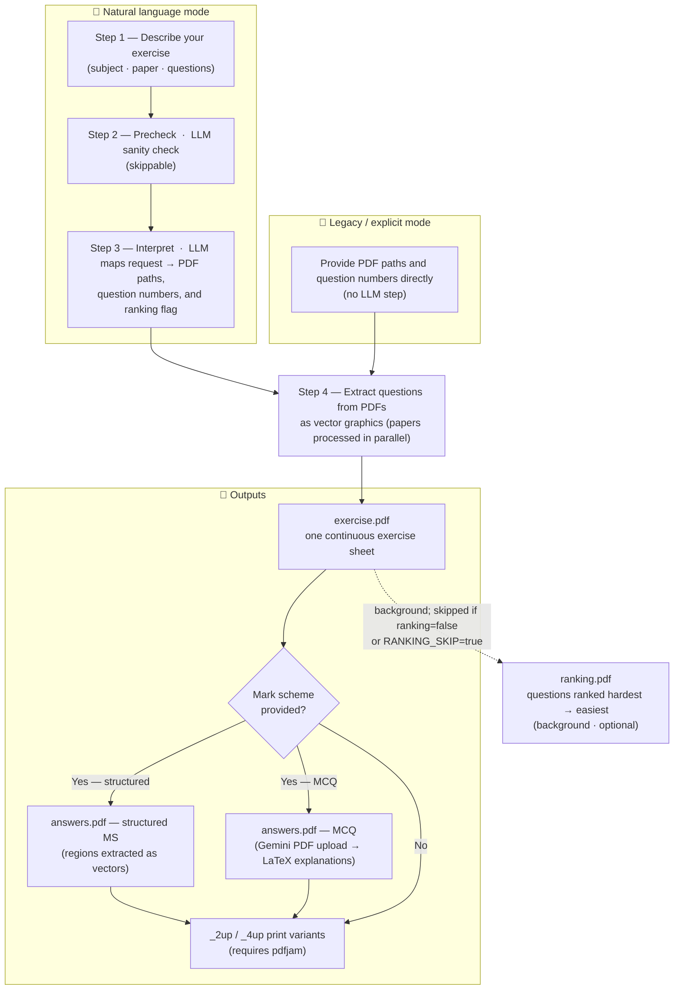
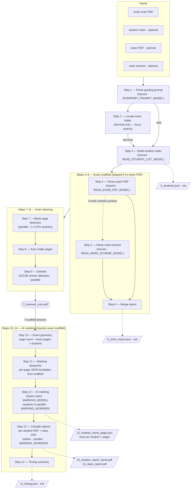

# eXercise


Build printable exercise sheets from Cambridge-style IGCSE question papers (PDF). You describe what you want in plain English or pass explicit file paths. The app extracts questions from bundled exam PDFs, optionally attaches mark-scheme answers, generates short MCQ explanations with an LLM, ranks questions by difficulty, and includes a browser for the bundled paper library. A separate **Grade** page accepts student exam scans and returns a cleaned, deskewed PDF ready for review.

---

## What you get

- **Natural language** — one sentence picks subject, session, paper, and question numbers; an LLM maps it to PDFs in your `exams/` folders.
- **Legacy CLI** — point at any QP PDF, list question numbers, optional mark scheme path.
- **Web UI** — three pages: **Generate** (exercise builder with PDF preview and zoom), **Grade** (scan cleaner), and **Library** (browse/download bundled papers).
- **PDF preview** — continuous-scroll in-browser render with Ctrl-wheel zoom; tabs for exercise, answers, 2-up, 4-up, and ranking variants; jump-to-question overview panel.
- **Outputs** — exercise PDF, optional answers PDF, optional 2-up/4-up print variants (`pdfjam`), and an LLM-generated difficulty ranking PDF.
- **Grading** — upload student scan(s) + optional roster; the pipeline auto-rotates, deskews, and removes blank pages, returning a clean PDF.
- **Library** — browse and download the bundled IGCSE papers by subject, year, and session directly from the web UI.

---

## How it works (step by step)

Overview (rendered on GitHub as a diagram):



### Natural language mode (one sentence)

1. **You describe the run** — subject, which paper(s), which question numbers, and whether you want mark-scheme material. This is the same idea in the CLI (one quoted argument) or in the web **Generate** page.

2. **Optional precheck** — a small LLM call checks that your text mentions a supported subject and enough detail to identify a paper (unless you turn precheck off in config).

3. **Main interpretation** — the LLM sees the list of real PDF filenames in your exam folders and returns structured data: which question paper(s) to open, which question numbers, output filename, matching mark scheme files when they exist, and a `ranking` flag (defaults to `true`; set to `false` by saying "no ranking" in your request).

4. **Cut questions from the PDFs** — all question papers are opened in parallel; for each, the program finds where each question sits on the page and extracts those regions as vector graphics (not screenshots), preserving crisp text and diagrams.

5. **Build the exercise PDF** — all extracted strips are combined into **one continuous PDF** (your exercise sheet), with layout and headers appropriate to the subject.

6. **Answers PDF (if a mark scheme is available)** — the matching mark scheme is opened. For typical structured MS layouts, answer regions are extracted the same way as questions. For **MCQ** mark schemes, the tool uploads the question-paper PDF directly to the **Gemini Files API** (one call per batch of papers) and receives short 3-bullet explanations for each question, which are compiled into LaTeX; if `pdflatex` or the Gemini key is missing, it falls back to plain answer lines.

7. **Optional n-up copies** — if `pdfjam` is installed, **2-up** and **4-up** versions of the exercise (and answers) may be generated for printing.

8. **Difficulty ranking (background, optional)** — a second LLM job reads the assembled exercise as images and returns a ranked list of every question part from hardest to easiest. The result is compiled into `*_ranking.pdf` and appears as an extra tab in the web UI once ready. Requires `pdflatex`. Skipped if: the NL request contains "no ranking" / "skip ranking" (sets `ranking: false`), `RANKING_SKIP=true` is set in the environment, or `pdflatex` is not installed.

### Legacy mode (explicit paths)

1. You pass **question paper path**, **output path**, and **question numbers** (and optionally `--ms` with a mark scheme path).

2. Steps **4–8** above run the same way — there is **no** LLM step; the program goes straight to finding questions and building PDFs.

---

## How grading works



| Step | Description |
|------|-------------|
| **1** | Gemini parses any free-text grading prompt and returns structured config (DPI, task type, student filter). Configure with `INTERPRET_PROMPT_MODEL` in `default.env`. |
| **2** | **Terminal route only.** A fuzzy folder search locates the exam folder on disk from the hint in the prompt or `--folder` flag. Skipped on the web route because the folder is determined by the upload. |
| **3** | The student roster is read from `StudentList.*` in the exam folder. Supports `.xlsx`, `.xls`, `.csv`, and `.pdf` formats via Gemini. Writes `3_students.json` (name array) and `3_students.md` (numbered list). Configure with `READ_STUDENT_LIST_MODEL`. |
| **4** | **Optional — requires exam PDF.** Gemini reads the exam paper and returns every question and sub-question with its number, type, marks, page, and answer options. Writes `4_exam_questions.json` + `.md`. Configure with `READ_EXAM_PDF_MODEL`. |
| **5** | **Optional — requires mark scheme.** Gemini reads the mark scheme and returns correct answers and marking criteria. Writes `5_mark_scheme.json` + `.md`. Configure with `READ_MARK_SCHEME_MODEL`. |
| **6** | Merges the exam question tree with mark scheme annotations into a single `6_short_report.json` + `.md`. Runs even without a mark scheme (exam-only report). This report drives steps 11–12. |
| **7** | Low-resolution raster pass (72 DPI) to classify each page as blank or content. Blank pages are dropped. Runs in parallel using up to `min(4, cpu_count)` threads. |
| **8** | Each content page's PDF `/Rotate` metadata is applied so scanners that encode rotation in metadata come out portrait. Optional Tesseract OSD pass for extra correction. |
| **9** | IGCSE header anchors are detected on each page (parallel). Anchor positions drive the fine deskew transform; corrected pages are written to `3_cleaned_scan.pdf`. |
| **10** | `scan_pages ÷ exam_pages` gives `num_students`. Cross-checked against the roster; a count mismatch is a warning, not an error. Writes `10_exam_geometry.json`. |
| **11** | For each exam page, leaf questions from the scaffold whose `.page` field matches are extracted into a per-page JSON blueprint (`11_ai_marking_blueprint_N.json`). These become the fill-in templates for step 12. |
| **12** | Each student's pages are rendered as JPEG and sent to the Qwen vision model (one API call per page). The model fills in `student_answer`, `assigned_marks`, and `reasoning` for every question. Page 1 of each student also gets a name-ID call (fuzzy-matched against the roster). Students are processed in parallel (`MARKING_WORKERS` threads); results written as `12_marked_name_N.json`. Requires `DASHSCOPE_API_KEY`. |
| **13** | Per-student results are merged (cross-page questions: take max marks). Each student gets `13_student_report_name.json`, `.md`, and a compiled `.pdf`. A class summary PDF with per-question averages is written as `13_class_report.pdf`. PDF compilation runs in parallel (`MARKING_WORKERS` xelatex processes). Requires `xelatex`. |
| **14** | Writes a `14_timing.json` and `.md` with wall-clock durations for each pipeline phase, API call counts, and per-student mark summaries. |

---

## Requirements

| | |
|---|---|
| **Python** | 3.10+ (3.12+ recommended) |
| **Python deps** | `pip install -r requirements.txt` |
| **Exam PDFs** | Under `exams/physics/`, `exams/computer_science/`, `exams/mathematics/` (see [`exams/README.md`](exams/README.md)). Paths are configurable in `eXercise/config.py`. |
| **LLM** | For natural-language mode and MCQ explanations: an API key for at least one provider below (see [Configuration](#configuration)). |

### Optional system tools

If missing, the app still runs; some features are skipped or simplified.

| Feature | Needs |
|--------|--------|
| **MCQ explanations** (nice PDF blocks) | `pdflatex` + TeX packages used in `eXercise/mcq_explanations.py` |
| **2-up / 4-up sheets** | `pdfjam` on `PATH` (e.g. Debian/Ubuntu: `texlive-extra-utils`) |
| **Difficulty ranking** | `pdflatex` (same as above); set `RANKING_SKIP=true` to disable |

**Ubuntu example:**

```bash
sudo apt update
sudo apt install -y texlive-latex-extra texlive-fonts-extra texlive-extra-utils
```

The **Dockerfile** installs TeX packages so containers get `pdflatex` and `pdfjam` without extra host setup.

### Grade page (optional)

The **Grade** page depends on the `xscore` package (not in `requirements.txt`) and API keys for the models it uses:

| | |
|---|---|
| `xscore` | Install separately if you want the scan-cleaning and AI-marking pipeline |
| `GEMINI_API_KEY` | Steps 1, 3, 4, 5 — prompt parsing, roster reading, exam and mark-scheme scaffold (`GOOGLE_API_KEY` accepted as fallback) |
| `DASHSCOPE_API_KEY` | Step 12 — AI marking via Qwen vision model |

If `xscore` is not installed, the rest of the app runs normally — only `/grade` will return errors.

---

## Quick setup

```bash
cd "/path/to/eXercise"
python3 -m venv .venv
source .venv/bin/activate          # Windows: .venv\Scripts\activate
pip install -r requirements.txt
```

Copy `.env.example` to `.env` and add your API keys (see below). Non-secret defaults live in **`default.env`** (committed).

---

## Configuration

### Where settings live

1. **`default.env`** — safe defaults (models, login flags). Does not override variables already set in the process environment.
2. **`.env`** at the project root (gitignored) — **secrets** (API keys) and machine-specific overrides. Wins over `default.env` for keys it defines.

**Rule of thumb:** put keys only in `.env`; put shared behaviour defaults in `default.env` and commit them.

### API keys (secrets → `.env`)

The app uses the OpenAI Python client against each vendor's **OpenAI-compatible** endpoint. **You choose models by name**; the **provider is inferred from the model name** (no separate "provider" switch).

| Model name starts with | API key variable | Notes |
|------------------------|------------------|--------|
| `gemini` | `GEMINI_API_KEY` | Google Gemini (`GOOGLE_API_KEY` accepted as fallback) |
| `grok` | `XAI_API_KEY` | xAI Grok |
| `qwen` | `DASHSCOPE_API_KEY` | Alibaba Qwen (DashScope) |

Copy [`.env.example`](.env.example) to `.env` and fill in the keys you need.

### Models and "thinking" (non-secrets → `default.env`)

- **`AI_DEFAULT_MODEL`** — fallback model (and optional thinking suffix) when a per-task variable is unset.
- **Per task** — each can override the default:

| Variable | Role |
|----------|------|
| `AI_PRECHECK_MODEL` | Fast validation before the main NL call |
| `NL_MODEL` | Prompt interpretation (subject, papers, questions) |
| `MCQ_MODEL` | MCQ explanation generation |
| `RANKING_MODEL` | Difficulty ranking job (questions ranked hardest to easiest) |
| `INTERPRET_PROMPT_MODEL` | xScore step 1 — parse grading prompt |
| `READ_STUDENT_LIST_MODEL` | xScore step 3 — parse student roster files (PDF, Excel, CSV) |
| `READ_EXAM_PDF_MODEL` | xScore step 4 — extract question hierarchy from exam PDF |
| `READ_MARK_SCHEME_MODEL` | xScore step 5 — extract answers and criteria from mark scheme |
| `MARKING_MODEL` | xScore step 12 — Qwen vision model for AI marking; requires `DASHSCOPE_API_KEY`; use `, off` to disable thinking (required for non-streaming JSON output) |
| `MARKING_WORKERS` | Parallel workers for step 12 (AI marking) and step 13 (xelatex compiles); default `4` |

**Optional thinking suffix:** add `, off`, `, low`, or `, high` after the model name:

```env
NL_MODEL=gemini-2.5-flash, low
AI_PRECHECK_MODEL=gemini-2.5-flash-lite, off
```

Omit the suffix to use the provider's default reasoning behaviour. **Gemini** maps `off` / `low` / `high` to API `reasoning_effort`. **Qwen** uses `off` vs on. **Grok** ignores the suffix.

Full model lists and notes (e.g. which Gemini tiers always use thinking) are in [`default.env`](default.env).

### Other LLM-related flags

| Variable | Meaning |
|----------|---------|
| `NL_SKIP_PRECHECK` | `true` / `1` / `yes` — skip the pre-validation step (e.g. tests). |
| `RANKING_SKIP` | `true` / `1` / `yes` — skip difficulty ranking entirely. |

Legacy fallbacks still supported in code: `AI_MCQ_MODEL` (alias for `MCQ_MODEL` resolution), `XAI_MODEL` (fallback model env), `XAI_PRECHECK_MODEL`.

### Web app (login)

| Variable | Meaning |
|----------|---------|
| `DISABLE_LOGIN` | `true` — open access; `false` — require `ACCESS_CODE`. |
| `ACCESS_CODE` | Used when login is required. |
| `APP_SECRET_KEY` | Optional; fixes session signing across restarts (set a long random value in production). |
| `ASK_LOGIN` | Optional; session-style cookie behaviour for testing (see `web/auth_gate.py`). |

Query hints: `?disable_login=0` forces the gate on for that request; `?ask_login=1` enables ask-login mode.

### Hosting tip

Some cloud IPs are blocked by xAI. **Gemini** often behaves better on shared/datacenter IPs than Grok.

---

## Usage

### Natural language (CLI)

```bash
python eXercise.py "Winter 2024 Physics paper 21, questions 12–14, include mark scheme"
```

### Legacy (explicit paths)

```bash
python eXercise.py /path/to/qp.pdf output.pdf 12 13 14
python eXercise.py /path/to/qp.pdf output.pdf 12-14 --ms /path/to/ms.pdf
```

### Module / help

```bash
python -m eXercise --help
```

### Web UI

Start the server and keep the terminal open:

```bash
source .venv/bin/activate
uvicorn web.app:app --reload --host 127.0.0.1 --port 8001
```

Open [http://127.0.0.1:8001](http://127.0.0.1:8001) (match the port you chose). If the port is busy, try `8002` — on many Macs **8000** is already taken (often by Docker).

Three pages are available:

| Page | Path | Purpose |
|------|------|---------|
| **Generate** | `/` | Build exercise sheets (natural language or legacy); PDF preview with tabs (exercise, answers, 2-up, 4-up, ranking), Ctrl-wheel zoom, and jump-to-question overview. |
| **Grade** | `/grade` | Upload student scan PDF, exam PDF, mark scheme, and optional roster; runs the full 14-step pipeline and returns a cleaned PDF plus per-student and class mark reports. Requires `xscore`, `GEMINI_API_KEY`, and `DASHSCOPE_API_KEY`. |
| **Library** | `/library` | Browse and download the bundled Cambridge IGCSE papers by subject, year, and session. |

### Programmatic

```python
from eXercise import run_extraction_jobs

run_extraction_jobs(
    [{"input_pdf": "...", "questions": [1, 2], "mark_scheme_pdf": "..."}],
    "sheet.pdf",
    exam_key="physics",  # or "computer_science", "mathematics", or None
)
```

---

## Docker

See **`Dockerfile`** and **`docker-compose.yml`**.

- Image: Python 3.12 + TeX for `pdflatex` / `pdfjam`, then `pip install -r requirements.txt`.
- Compose maps host **80** → container **8000** by default.
- Load **`default.env`** then **`.env`** on the host; keep secrets only in `.env`.

```bash
docker compose up -d --build
```

After code changes: `git pull`, then `docker compose up -d --build` again.

---

## Output

The two pipelines write to separate sub-folders under `output/`:

| Pipeline | Location |
|----------|----------|
| **eXercise** (exercise sheets) | `output/exercise/<stem>/` |
| **xScore** (exam scans, terminal) | `output/xscore/<exam_stem>/<timestamp>/` |
| **xScore** (web grade uploads) | `output/xscore/grade_uploads/<id>/` |

- `<stem>` is derived from the output PDF filename (e.g. `physics_exercise.pdf` → `output/exercise/physics_exercise/`).
- Mark scheme runs can produce `*_answers.pdf` beside the main sheet.
- With `pdfjam`, **`_2up`** and **`_4up`** variants may appear next to the main PDF.
- If `pdflatex` is installed and `RANKING_SKIP` is not set, a **`*_ranking.pdf`** is generated in the background.

---

## Project layout

| Path | Role |
|------|------|
| `eXercise.py` | CLI entry |
| `eXercise/` | Config, pipeline, NL resolver, MCQ explanations, difficulty ranking, PDF layout |
| `xScore.py` | xScore pipeline entry (steps 1–14) |
| `xscore/marking/` | Steps 1, 3–6, 10–14 — prompt parsing, scaffold, blueprints, AI marking, report compilation |
| `xscore/preprocessing/` | Steps 7–9 — blank detection, rotation, deskew |
| `xscore/shared/` | Terminal UI, exam path helpers, config |
| `web/app.py` | FastAPI routes and job store |
| `web/grade_service.py` | Web-facing wrapper for the xScore pipeline |
| `web/templates/` | Jinja2 HTML pages (Generate, Grade, Library) |
| `web/static/` | CSS + JS (PDF preview, zoom, tabs, download-all) |
| `exams/` | Bundled QP/MS PDFs for NL mode |
| `fonts/` | Latin Modern for labels (see `fonts/README.md`) |
| `default.env` | Committed defaults |
| `.env.example` | Template for secrets |

---

## License

No default license is included; add a `LICENSE` file if you want to specify terms.
