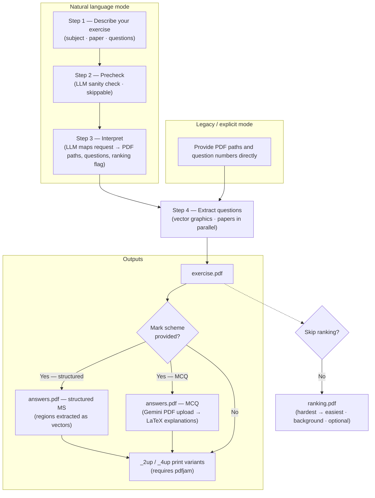
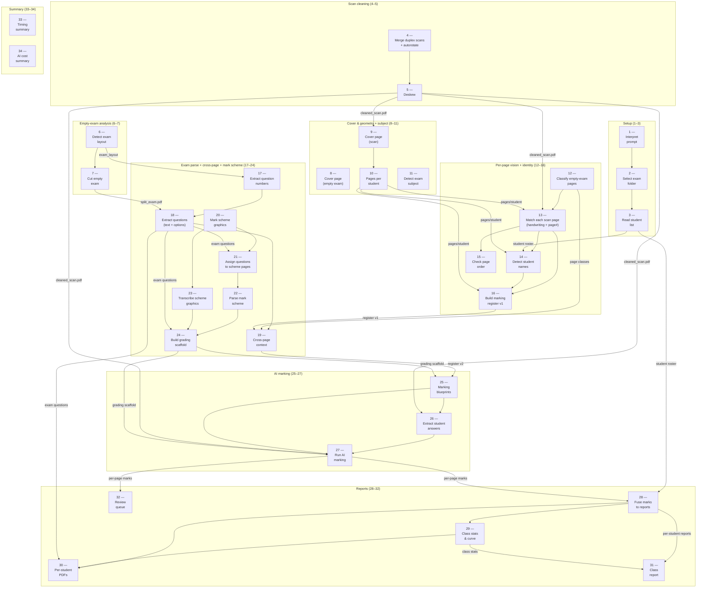
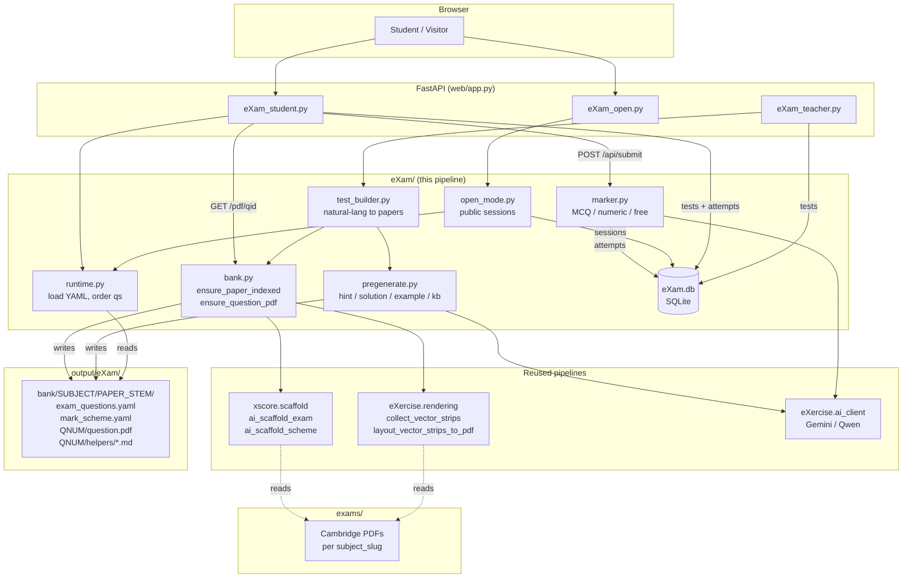

# eXercise

**Version 0.5**


Three pipelines for Cambridge-style IGCSE exam workflows. **eXercise** assembles printable practice sheets from bundled question papers — you describe the run in plain English, an LLM resolves it to PDF paths and question numbers, and the app extracts question regions as vector graphics, optionally attaches mark-scheme answers, generates MCQ explanations, and ranks by difficulty. **xScore** marks scanned student exams: it cleans the scan, identifies students, parses the mark scheme, runs an AI vision model over each page, and emits per-student PDF reports plus a class summary. **eXam** serves Cambridge past papers on-screen with AI marking — students practise individual questions cropped from the source PDF, every submission is graded by AI against an auto-extracted mark scheme, and hints / solutions / examples / knowledge-base topics are lazily generated per question. All three pipelines share a FastAPI web UI (Generate / Grade / Library / Practice) and the same multi-provider AI client (Gemini, Qwen, Grok).

---

## What you get

- **Natural language** — one sentence picks subject, session, paper, and question numbers; an LLM maps it to PDFs in your `exams/` folders.
- **Legacy CLI** — point at any QP PDF, list question numbers, optional mark scheme path.
- **Web UI** — three pages: **Generate** (exercise builder with PDF preview and zoom), **Grade** (scan cleaner), and **Library** (browse/download bundled papers).
- **PDF preview** — continuous-scroll in-browser render with Ctrl-wheel zoom; tabs for exercise, answers, 2-up, 4-up, and ranking variants; jump-to-question overview panel.
- **Outputs** — exercise PDF, optional answers PDF, optional 2-up/4-up print variants (`pdfjam`), and an LLM-generated difficulty ranking PDF.
- **Grading** — upload student scan(s) + optional roster; the pipeline auto-rotates, deskews, and removes blank pages, returning a clean PDF.
- **Library** — browse and download the bundled IGCSE papers by subject, year, and session directly from the web UI.

---

## Contents

- [What you get](#what-you-get)
- **Pipelines**
  - [eXercise pipeline — exercise sheet generation](#exercise-pipeline)
    - [Natural language mode](#natural-language-mode-one-sentence)
    - [Legacy mode](#legacy-mode-explicit-paths)
  - [xScore pipeline — exam scan grading](#xscore-pipeline)
    - [Per-step details (1–34)](#per-step-details-134)
  - [eXam pipeline — on-screen practice with AI marking](#exam-pipeline)
    - [Two modes](#two-modes)
    - [Pipeline at a glance](#pipeline-at-a-glance)
    - [Modules](#modules)
    - [Data flow](#data-flow)
    - [On-disk layout](#on-disk-layout)
    - [Entry points](#entry-points)
    - [Cost & caching notes](#cost--caching-notes)
- [Requirements](#requirements)
  - [Optional system tools](#optional-system-tools)
  - [Grade page (optional)](#grade-page-optional)
- [Quick setup](#quick-setup)
- [Usage](#usage)
  - [Natural language (CLI)](#natural-language-cli)
  - [Legacy (explicit paths)](#legacy-explicit-paths)
  - [Grading (CLI)](#grading-cli)
  - [Web UI](#web-ui)
  - [Programmatic](#programmatic)
- [Configuration](#configuration)
  - [Where settings live](#where-settings-live)
  - [API keys (secrets → `.env`)](#api-keys-secrets--env)
  - [Models, thinking, and token budgets (non-secrets → `default.env`)](#models-thinking-and-token-budgets-non-secrets--defaultenv)
  - [Other LLM-related flags](#other-llm-related-flags)
  - [Web app (login)](#web-app-login)
  - [Hosting tip](#hosting-tip)
- [Docker](#docker)
- [Output](#output)
- [Project layout](#project-layout)
- [License](#license)

---

## eXercise pipeline

*Exercise sheet generation — describe the run in plain English, an LLM resolves it to PDF paths and question numbers, and the app extracts question regions as vector graphics, optionally attaches mark-scheme answers, generates MCQ explanations, and ranks by difficulty.*

Overview (rendered on GitHub as a diagram):



### Natural language mode (one sentence)

1. **You describe the run** — subject, which paper(s), which question numbers, and whether you want mark-scheme material. This is the same idea in the CLI (one quoted argument) or in the web **Generate** page.

2. **Optional precheck** — a small LLM call checks that your text mentions a supported subject and enough detail to identify a paper (unless you turn precheck off in config).

3. **Main interpretation** — the LLM sees the list of real PDF filenames in your exam folders and returns structured data: which question paper(s) to open, which question numbers, output filename, matching mark scheme files when they exist, and a `ranking` flag (defaults to `true`; set to `false` by saying "no ranking" in your request).

4. **Cut questions from the PDFs** — all question papers are opened in parallel; for each, the program finds where each question sits on the page and extracts those regions as vector graphics (not screenshots), preserving crisp text and diagrams.

5. **Build the exercise PDF** — all extracted strips are combined into **one continuous PDF** (your exercise sheet), with layout and headers appropriate to the subject.

6. **Answers PDF (if a mark scheme is available)** — the matching mark scheme is opened. For typical structured MS layouts, answer regions are extracted the same way as questions. For **MCQ** mark schemes, the tool uploads the question-paper PDF directly to the **Gemini Files API** (one call per batch of papers) and receives short 3-bullet explanations for each question, which are compiled into LaTeX; if `pdflatex` or the Gemini key is missing, it falls back to plain answer lines.

7. **Optional n-up copies** — if `pdfjam` is installed, **2-up** and **4-up** versions of the exercise (and answers) may be generated for printing.

8. **Difficulty ranking (background, optional)** — a second LLM job reads the assembled exercise as images and returns a ranked list of every question part from hardest to easiest. The result is compiled into `*_ranking.pdf` and appears as an extra tab in the web UI once ready. Requires `pdflatex`. Skipped if: the NL request contains "no ranking" / "skip ranking" (sets `ranking: false`), `RANKING_SKIP=true` is set in the environment, or `pdflatex` is not installed.

### Legacy mode (explicit paths)

1. You pass **question paper path**, **output path**, and **question numbers** (and optionally `--ms` with a mark scheme path).

2. Steps **4–6** above run the same way — there is **no** LLM step; the program goes straight to finding questions and building PDFs.

---

## xScore pipeline

*Exam scan grading — cleans the scan, identifies students, parses the mark scheme, runs an AI vision model over each page, and emits per-student PDF reports plus a class summary. 34 sequential steps with parallelism inside individual phases.*

All four input files are required:

- **scan PDF** — the class exam scan (e.g. `scan.pdf`)
- **student roster** — `StudentList.xlsx` / `.csv` / `.pdf`
- **empty exam PDF** — blank exam template (`empty_exam.pdf`)
- **mark scheme PDF** — answer key (`answer_sheet.pdf`)

```mermaid
flowchart TD
    subgraph uploads ["Inputs (all required)"]
        direction LR
        u1[exam scan PDF]
        u2[student roster]
        u3[exam PDF]
        u4[mark scheme PDF]
    end

    s1["Step 1 —\nInterpret prompt\n(Gemini ·\nINTERPRET_PROMPT_MODEL)"]
    s2["Step 2 —\nSelect exam folder\n(terminal only ·\nfuzzy search)"]
    s3["Step 3 —\nRead student list\n(Gemini ·\nREAD_STUDENT_LIST_MODEL)"]
    routeCond{"Terminal or\nweb route?"}

    subgraph cleaning ["Scan cleaning (steps 4–5)"]
        direction TB
        s4["Step 4 —\nMerge duplex scans + autorotate\n(per-file orientation detection;\nduplex merge if numbered pairs exist)"]
        s5["Step 5 —\nDeskew scanned pages\n(IGCSE anchor\ndetection · parallel)"]
        s4 --> s5
    end

    subgraph emptyexam ["Empty-exam analysis (steps 6–7)"]
        direction TB
        s6["Step 6 —\nDetect empty\nexam layout\n(DETECT_LAYOUT_MODEL)"]
        s7["Step 7 —\nCut empty exam\n(1×1 → copied ·\nmulti-up →\nsplit sub-pages)"]
        s6 --> s7
    end

    subgraph geometry ["Cover & geometry + subject (steps 8–11)"]
        direction TB
        s8["Step 8 —\nDetect cover page\nin empty exam\n(EMPTY_EXAM_COVER_MODEL)"]
        s9["Step 9 —\nDetect cover page\nin scanned exam\n(page 1 only ·\nCOVER_PAGE_DETECTION_MODEL)"]
        s10["Step 10 —\nCalculate pages\nper student\n(scan÷exam pages →\nnum_students ·\nabort on mismatch)"]
        s11["Step 11 —\nDetect exam subject\n(filename heuristic →\nGemini AI fallback ·\nSUBJECT_DETECTION_MODEL)"]
        s8 --> s9 --> s10 --> s11
    end

    subgraph identity ["Per-page vision + identity + ordering (steps 12–16)"]
        direction TB
        s12["Step 12 —\nClassify empty-exam pages\n(cover/instruction/question/\nblank/writing-space ·\nEMPTY_EXAM_PAGE_CLASSIFICATION_MODEL)"]
        s13["Step 13 —\nMatch each scan page\n(handwriting + page# + page type ·\nparallel · HANDWRITING_CHECK_MODEL)"]
        s14["Step 14 —\nDetect student names\n(cover-anchored from step 13 ·\nNAME_DETECTION_MODEL · parallel)"]
        s15["Step 15 —\nCheck page order\n(heuristic over step 13's\npage numbers — no LLM)"]
        s16["Step 16 —\nBuild marking page\nregister v1\n(pure data transform ·\nno LLM)"]
        s12 --> s13 --> s14 --> s15 --> s16
    end

    subgraph scaffold ["Exam parse + cross-page + mark scheme (steps 17–24)"]
        direction TB
        s17["Step 17 —\nExtract question numbers\nfrom empty exam\n(EXTRACT_EXAM_QUESTION_NUMBERS_MODEL)"]
        s18["Step 18 —\nExtract questions\nfrom empty exam\n(text + options · per-page parallel ·\nEXTRACT_EXAM_QUESTIONS_MODEL)"]
        s19["Step 19 —\nDetect cross-page\ncontext\n(continuation + figures +\nparent stems · no LLM)"]
        s20["Step 20 —\nDetect mark scheme\ngraphics\n(DETECT_SCHEME_GRAPHICS_MODEL\n· PNG only)"]
        s21["Step 21 —\nAssign questions\nto mark scheme pages\n(ASSIGN_SCHEME_QUESTIONS_MODEL\n· Gemini: native PDF\n· Qwen: per-page PNG)"]
        s22["Step 22 —\nParse mark scheme\n(READ_MARK_SCHEME_MODEL)\n(Gemini: native PDF\n· Qwen: per-page PNG)"]
        s23["Step 23 —\nTranscribe mark\nscheme graphics\n(TRANSCRIBE_SCHEME_GRAPHIC_MODEL\n· per-graphic parallel)"]
        s24["Step 24 —\nBuild grading\nscaffold\n(merges question tree\n+ mark scheme)"]
        s17 --> s18 --> s19 --> s20 --> s21 --> s22 --> s23 --> s24
    end

    subgraph marking ["AI marking (steps 25–27)"]
        direction TB
        s25["Step 25 —\nBuild AI marking\nblueprints\n(per-page templates\nfrom scaffold)"]
        s26["Step 26 —\nExtract student answers\n(transcribe-only pass ·\nEXTRACT_ANSWERS_MODEL ·\nMARKING_WORKERS parallel)"]
        s27["Step 27 —\nRun AI marking\n(MARKING_MODEL ·\nMARKING_WORKERS\nparallel)\n(Gemini: native PDF\n· Qwen: per-page JPEG)"]
        s25 --> s26 --> s27
    end

    subgraph reports ["Reports (steps 28–32)"]
        direction TB
        s28["Step 28 —\nFuse AI marking\noutput to\nstudent reports\n(merge per-page marks\n· cross-page max)"]
        s29["Step 29 —\nCompute class\nstatistics + curve\n(per-question averages\n· grade distribution)"]
        s30["Step 30 —\nGenerate per-student\nreports\n(landscape + portrait\n+ 2UP · xelatex ·\nMARKING_WORKERS\nparallel)"]
        s31["Step 31 —\nGenerate class report"]
        s32["Step 32 —\nBuild review queue\n(low-confidence marks\nfor manual review)"]
        s28 --> s29 --> s30 --> s31 --> s32
    end

    subgraph summary ["Summary (steps 33–34)"]
        direction TB
        s33["Step 33 —\nSummarise step\ntimings\n(wall-clock per phase\n· API call counts)"]
        s34["Step 34 —\nSummarise AI costs\n(token counts ·\nRMB cost per model)"]
        s33 --> s34
    end

    bg["Pre-render scan pages\n(background thread ·\nMARKING_WORKERS)"]

    uploads --> s1
    s1 --> routeCond
    routeCond -->|terminal| s2 --> s3
    routeCond -->|web| s3
    s3 --> cleaning --> emptyexam --> geometry --> identity --> scaffold --> marking --> reports --> summary
    s13 -.->|kicks off| bg
    bg -.->|images ready| s27
```



Same pipeline as a flat sequence — step-by-step from 1 to 34:

```mermaid
flowchart TD
    subgraph setup["Setup (1–3)"]
        s1["1 —\nInterpret\nprompt"] --> s2["2 —\nSelect exam\nfolder"] --> s3["3 —\nRead student\nlist"]
    end
    subgraph scan["Scan cleaning (4–5)"]
        s4["4 —\nMerge duplex scans\n+ autorotate"] --> s5["5 —\nDeskew"]
    end
    subgraph emptyexam["Empty-exam analysis (6–7)"]
        s6["6 —\nDetect exam\nlayout"] --> s7["7 —\nCut empty\nexam"]
    end
    subgraph geometry["Cover & geometry + subject (8–11)"]
        s8["8 —\nCover page\n(empty exam)"] --> s9["9 —\nCover page\n(scan)"] --> s10["10 —\nPages per\nstudent"] --> s11["11 —\nDetect exam\nsubject"]
    end
    subgraph identity["Per-page vision + identity (12–16)"]
        s12["12 —\nClassify empty-exam\npages"] --> s13["13 —\nMatch each scan page\n(handwriting + page#)"] --> s14["14 —\nDetect student\nnames"] --> s15["15 —\nCheck page\norder"] --> s16["16 —\nBuild marking\nregister v1"]
    end
    subgraph scaffold["Exam parse + cross-page + mark scheme (17–24)"]
        s17["17 —\nExtract question\nnumbers"] --> s18["18 —\nExtract questions\n(text + options)"] --> s19["19 —\nCross-page\ncontext"] --> s20["20 —\nMark scheme\ngraphics"] --> s21["21 —\nAssign questions\nto scheme pages"] --> s22["22 —\nParse mark\nscheme"] --> s23["23 —\nTranscribe scheme\ngraphics"] --> s24["24 —\nBuild grading\nscaffold"]
    end
    subgraph marking["AI marking (25–27)"]
        s25["25 —\nMarking\nblueprints"] --> s26["26 —\nExtract student\nanswers"] --> s27["27 —\nRun AI\nmarking"]
    end
    subgraph reports["Reports (28–32)"]
        s28["28 —\nFuse marks\nto reports"] --> s29["29 —\nClass stats\n& curve"] --> s30["30 —\nPer-student\nPDFs"] --> s31["31 —\nClass\nreport"] --> s32["32 —\nReview\nqueue"]
    end
    subgraph summary["Summary (33–34)"]
        s33["33 —\nTiming\nsummary"] --> s34["34 —\nAI cost\nsummary"]
    end

    s3 --> s4
    s5 --> s6
    s7 --> s8
    s11 --> s12
    s16 --> s17
    s24 --> s25
    s27 --> s28
    s32 --> s33
```



Same pipeline as a data-flow graph — arrows are artifact handoffs and cross-phase arrows are labeled with the artifact passed. The user's exam folder feeds s4 (raw scans), s6/s8/s12/s17 (empty exam), and s20 (mark scheme).



**Steps (1–34):**

**Prompt, folder & roster (1–3)**
- 1 — Interpret prompt
- 2 — Select exam folder
- 3 — Read student list

**Scan cleaning (4–5)**
- 4 — Merge duplex scans
- 5 — Deskew scanned pages

**Empty-exam analysis (6–7)**
- 6 — Detect empty exam layout
- 7 — Cut empty exam

**Cover & geometry + subject (8–11)**
- 8 — Detect cover page in empty exam
- 9 — Detect cover page in scanned exam
- 10 — Calculate number of scanned exam pages per student
- 11 — Detect exam subject (filename heuristic → Gemini AI fallback)

**Per-page vision + identity + ordering (12–16)**
- 12 — Classify empty-exam pages (cover/instruction/question/blank/writing-space)
- 13 — Match each scan page (handwriting + page# + page type)
- 14 — Detect student names (cover-anchored from step 13)
- 15 — Check page order (heuristic over step 13)
- 16 — Build marking page register v1 (data transform)

**Exam parse + cross-page + mark scheme (17–24)**
- 17 — Extract question numbers from empty exam
- 18 — Extract questions from empty exam (text + options)
- 19 — Detect cross-page context (continuation pages + figures + parent stems)
- 20 — Detect mark scheme graphics
- 21 — Assign questions to mark scheme pages
- 22 — Parse mark scheme
- 23 — Transcribe mark scheme graphics
- 24 — Build grading scaffold

**AI marking (25–27)**
- 25 — Build AI marking blueprints
- 26 — Extract student answers (transcribe-only pass)
- 27 — Run AI marking

**Reports (28–32)**
- 28 — Fuse AI marking output to student reports
- 29 — Compute class statistics + curve
- 30 — Generate per-student reports (landscape + portrait + 2UP)
- 31 — Generate class report
- 32 — Build review queue

**Summary (33–34)**
- 33 — Summarise step timings
- 34 — Summarise AI costs

The pipeline is **sequential at the orchestration level**. The only true concurrency is (a) a background thread that pre-renders all scan pages to JPEG starting just after step 14 (`student_names`) — so steps 28 and 29 don't block on rasterisation — (b) `MARKING_WORKERS` parallelism *inside* steps 28 (per-page transcription), 29 (per-page marking), and 32 (one xelatex process per student PDF), and (c) per-step `*_WORKERS` env vars for the parallel sites in steps 14, 15, 16, 20, 22, 23, 24, and 25 (each fans out one task per LLM call on a `ThreadPoolExecutor`; defaults are uncapped via `default.env`).

**Per-page data flow (steps 14 → 15 → 16 → 17 → 18 → 21 → 28 → 29).** Step 12 vision-classifies every page of the *empty* exam paper into a closed vocabulary (`cover|instruction|question|blank|writing-space`) and writes `12_classify_empty_exam_pages/empty_exam_classifications.json`. Step 13 then matches every *scan* page against that catalog (page type + page number + handwriting) and writes `13_student_handwriting_check/handwriting.json`. Steps 16, 17, and 18 all consume step 13's artifact:
- Step 14 uses the AI-detected covers as anchors for student-name OCR.
- Step 15 verifies each student's detected page-number sequence (no LLM, no OCR).
- Step 16 joins step 13's per-page handwriting flags with step 14's `page_assignments` to write the v1 marking page register: one primary call per non-cover scan page that has handwriting. No extras yet — that's all step 19's job.

Step 19 (`detect_cross_page_context`) refines the v1 register into v2 with three passes — (1) **continuation**: scan pages whose answer label projects onto a `blank` or `writing-space` empty-exam page are removed from primary calls and re-attached as extras to the most recent preceding `question page` call; (2) **figures**: pages mentioning a figure drawn elsewhere get the figure's drawn-on page as an extra; (3) **parents**: child questions get their parent's stem page as an extra. Multiple consecutive blank/writing-space pages with handwriting after the same question page all attach to that question page in scan-page order.

Steps 28 (transcribe-only) and 29 (AI marking) read the v2 register: scan pages flagged no-handwriting are dropped (no API call), continuation/figure/parent pages are bundled as additional images on the call for the page they attach to.

**Subject-specific prompt formatting (step 11 → steps 19, 20, 24, 28, 29).** Step 11 detects the exam subject and writes `11_detect_subject/subject.json`. Detection runs in two tiers: filename heuristic first (matches against `Subject.filename_patterns` in `xscore/shared/subjects.py`, e.g. `"0478"` → Computer Science) and Gemini AI fallback on the first 2 pages of the empty exam when no filename matched. Subjects flagged `needs_code_formatting=True` (Computer Science today) inject the `## CODE_FORMATTING` section into the scaffold + marking prompts so code/pseudocode renders monospace via `\texttt{…}` / `\begin{alltt}…\end{alltt}`. Other subjects (Physics today) skip that section.

Each run writes one folder per step under `output/xscore/<exam>/<timestamp>/`, named `NN_step_name/` (e.g. `05_deskew/`, `27_ai_marking/`). This layout is what `--resume-dir` reads from — see [Usage](#usage) for partial-run flags.

### Per-step details (1–34)

#### Prompt, folder & roster (1–3)

| Step | Description |
|------|-------------|
| **1 — Interpret prompt** | • Parses any free-text grading prompt into structured config (DPI, task type, student filter)<br>• Configure with `INTERPRET_PROMPT_MODEL` in `default.env` |
| **2 — Select exam folder** | • Terminal route only — skipped on the web route<br>• Fuzzy folder search locates the exam folder from the prompt hint or `--folder` flag |
| **3 — Read student list** | • Reads `StudentList.*` from the exam folder (`.xlsx`, `.xls`, `.csv`, `.pdf` via Gemini)<br>• Writes `03_read_student_list/students.json` and `students.md`<br>• Configure with `READ_STUDENT_LIST_MODEL` |

#### Scan cleaning (4–5)

| Step | Description |
|------|-------------|
| **4 — Prepare scans** | • Always runs. Detects per-scan-file orientation (Tesseract OSD by default; AI vision via `SCAN_ORIENTATION_MODEL` when Tesseract is unavailable or `SCAN_ORIENTATION_DETECTOR=ai`) and bakes the result into each page's `/Rotate` metadata — this is the **single rotation authority** for the rest of the pipeline<br>• If two or more numbered scan PDFs are found (duplex front/back), interleaves them into `04_prepare_scans/merged_scan.pdf`; with a single scan file, writes `oriented_scan.pdf` (or returns the source unchanged when no rotation is needed)<br>• Two-stage majority voting: `SCAN_ORIENTATION_INITIAL_VOTES` initial samples, escalates with up to `SCAN_ORIENTATION_ESCALATION_VOTES` more on disagreement<br>• Writes `04_prepare_scans/scan_orientations.json` (per-file decision audit) |
| **5 — Deskew scanned pages** | • Detects IGCSE header anchors on each page (parallel)<br>• Anchor positions drive a fine deskew transform<br>• Corrected pages written to `05_deskew/cleaned_scan.pdf` |

#### Empty-exam analysis (6–7)

These two steps only need the empty exam PDF (no scan dependency); they're pulled forward so problems with the empty exam surface early. They produce the cut/split version that several later steps consume.

| Step | Description |
|------|-------------|
| **6 — Detect empty exam layout** | • AI vision call detects the printing layout of the exam PDF (1×1, 2-up, 4-up) (`DETECT_LAYOUT_MODEL`)<br>• Writes `06_detect_exam_layout/exam_layout.json` + `.md` |
| **7 — Cut empty exam** | • Pure geometry step — no AI call<br>• 1×1 layout: copies the PDF to `07_cut_exam_pdf/exam_input.pdf`<br>• Multi-up: crops and reassembles each physical page into one PDF page per sub-page in reading order; writes `07_cut_exam_pdf/split_exam.pdf`<br>• Step 12 (empty-exam classification) reads this output, so multi-up exams are classified on the logical page count |

#### Cover & geometry + subject (8–11)

| Step | Description |
|------|-------------|
| **8 — Detect cover page in empty exam** | • Checks page 1 of the empty exam PDF for a cover page (`EMPTY_EXAM_COVER_MODEL`)<br>• Informational; sets `empty_exam_has_cover` (consumed by step 16's register builder)<br>• Non-fatal: network errors are logged; pipeline continues<br>• Writes prompt artifacts to `08_cover_page_empty_exam/` |
| **9 — Detect cover page in scanned exam** | • Checks scan page 1 only for a cover page (`COVER_PAGE_DETECTION_MODEL`)<br>• Sets `cover_page_mode` — final after this step; drives `pages_per_student` in step 10<br>• Non-fatal: if `GEMINI_API_KEY` is not set, detection is skipped (standard mode assumed)<br>• Writes prompt artifacts to `09_cover_page_scan_first/` |
| **10 — Calculate number of scanned exam pages per student** | • Deterministic arithmetic: `pages_per_student = exam_pages + (1 if cover_page_mode else 0)`<br>• Aborts with `SystemExit(1)` if `scan_pages` is not an exact multiple of `pages_per_student` — re-scan the missing/extra page(s) and re-run<br>• Cross-checks against the roster; mismatch is a warning, not an error<br>• Writes `10_exam_geometry/exam_geometry.json` |
| **11 — Detect exam subject** | • Two-tier: filename heuristic first (matches each input PDF name against `Subject.filename_patterns` in `xscore/shared/subjects.py`, e.g. `"0478"` → Computer Science), Gemini AI fallback on the first 2 pages of the empty exam if nothing matched (`SUBJECT_DETECTION_MODEL`, default `gemini-3.1-flash-lite`)<br>• Available subjects come from `AVAILABLE_SUBJECTS` env var; structured-output schema enforces the choice<br>• Sets `ctx.subject`; gates the `## CODE_FORMATTING` prompt section in steps 19, 20, 24, 27, 28<br>• Writes `11_detect_subject/subject.json` (with `detection_method: filename` or `ai`) + `subject.md` |

#### Per-page vision + identity + ordering (12–16)

Step 12 builds a closed page-type catalog from the *empty* exam paper. Step 13 then matches every *scan* page against that catalog (page type + page number) and detects handwriting in the same call. Steps 16, 17, and 18 consume step 13's output.

| Step | Description |
|------|-------------|
| **12 — Classify empty-exam pages** | • One vision call per page of the (cut) empty exam paper, classifying each into `cover page \| instruction page \| question page \| blank page \| writing space page` plus its printed page number<br>• Builds the closed-vocabulary catalog that step 13 matches scan pages against, and that step 19 uses to decide which scan pages are continuation pages<br>• Configure with `EMPTY_EXAM_PAGE_CLASSIFICATION_MODEL` (default `gemini-3.5-flash`); Gemini → native PDF per-page slice, others → rasterized JPEG fallback<br>• Parallel (`EMPTY_EXAM_PAGE_CLASSIFICATION_WORKERS`)<br>• Writes `12_classify_empty_exam_pages/empty_exam_classifications.json` and per-page PDF/JPEGs + prompt sidecars under `empty_exam_pages/` |
| **13 — Match each scan page** | • Per-scan-page vision call: given step 12's catalog, MATCHES each scan page against the known empty-exam page types and page numbers (plus an N+3 buffer for overflow). Returns `page_type`, `matched_page_number`, and `has_handwriting`<br>• Configure with `HANDWRITING_CHECK_MODEL`<br>• Parallel (one task per scan page; `HANDWRITING_WORKERS`)<br>• Writes `13_student_handwriting_check/handwriting.json` (flat `scan_pages` list + `metadata` block) and per-page JPEGs |
| **14 — Detect student names** | • Reads step 13's per-scan-page entries to anchor name OCR to AI-confirmed cover positions<br>• Disagreement with positional covers (computed from `pages_per_student`) is logged as a warning — likely misorder<br>• Renders the cover pages at `NAME_RECOGNITION_DPI` (300 DPI)<br>• Per-cover-page name OCR call (`NAME_DETECTION_MODEL`); fuzzy-matched against the roster<br>• Writes `14_student_names/exam_student_list.json` / `.md`<br>• Immediately after this step, the runner kicks off background pre-rendering of every scan page to JPEG so steps 28 and 29 don't block on rasterisation |
| **15 — Check page order** | • Pure heuristic — no LLM, no OCR<br>• For each student, looks up the matched page number for every page they own and verifies the sequence matches the empty-exam layout (with `cover_offset` adjustment)<br>• Non-fatal by default; set `PAGE_ORDER_CHECK_STRICT=1` to fail-fast on detected mismatch<br>• Mismatches are summarised in the terminal as `<student> scan N: detected M (expected K)` |
| **16 — Build marking page register v1** | • Pure data transform — no LLM call<br>• Joins step 13's per-page handwriting flags with step 14's `page_assignments` and `empty_exam_has_cover` from step 8 into the v1 marking page register<br>• One primary call per non-cover scan page that has handwriting; pages flagged no-handwriting are dropped (`skipped_scan_pages`). No extras yet — that's step 19's job.<br>• Writes `16_build_marking_register_v1/marking_page_register.json` |

#### Exam parse + cross-page + mark scheme (17–24)

| Step | Description |
|------|-------------|
| **17 — Extract question numbers from empty exam** | • One cheap call against the cut PDF returns `number/type/page/subpage/marks` (no text)<br>• Configure with `EXTRACT_EXAM_QUESTION_NUMBERS_MODEL`<br>• Writes `17_extract_exam_question_numbers/exam_scaffold.{yaml,json,xml}` |
| **18 — Extract questions from empty exam** | • Per-page parallel calls populate `text` and `options` for each question<br>• Reads step 17's scaffold from `ctx.scaffold_state` (in-memory, same run) or disk (resume)<br>• Configure with `EXTRACT_EXAM_QUESTIONS_MODEL`<br>• Parallel (`EXTRACT_EXAM_QUESTIONS_WORKERS`)<br>• Writes `18_extract_exam_questions/exam_questions.{yaml,json,xml}` + `pages/*.pdf` |
| **19 — Detect cross-page context** | • Pure data transform — no LLM call<br>• Augments the v1 register from step 16 with three passes: (1) **continuation** — scan pages projecting onto a `blank` or `writing space` empty-exam page (per step 12's catalog) are removed from primary calls and re-attached as extras to the most recent preceding `question page` call. Multiple consecutive overflow pages after the same question page all attach in scan-page order. (2) **figures** — "Fig. N.N" mentioned on a different page from where it's drawn. (3) **parent stems** — child sub-questions get their parent's flowchart/stem attached.<br>• Writes `19_detect_cross_page_context/marking_page_register.json` (v2) plus three diagnostic JSONs (`continuation_refs.json`, `cross_page_refs.json`, `parent_refs.json`) and a `changes.md` summary<br>• Toggle parent pass via `CROSS_PAGE_PARENT_DETECTION` |
| **20 — Detect mark scheme graphics** | • Detects graphics (diagrams, tables) on each mark scheme page; crops bounding boxes to `20_detect_mark_scheme_graphics/` (`DETECT_SCHEME_GRAPHICS_MODEL`) |
| **21 — Assign questions to mark scheme pages** | • Cheap per-page vision call asks which question numbers' criteria appear on each mark scheme page (`ASSIGN_SCHEME_QUESTIONS_MODEL`; Gemini → PDF upload, Qwen → PNG)<br>• Step 22 then sends only the relevant questions per page instead of the full scaffold — fewer hallucinations on pages with 1–3 of N questions<br>• Writes `21_assign_scheme_questions/questions_per_page.json`<br>• Skipped when env var is unset → step 22 falls back to full-scaffold behaviour |
| **22 — Parse mark scheme** | • Reads the mark scheme and returns correct answers and marking criteria (`READ_MARK_SCHEME_MODEL`)<br>• Per-page scaffold is filtered by step 21's mapping (or full scaffold when step 21 was skipped)<br>• Writes `22_parse_mark_scheme/mark_scheme.json` + `.md` |
| **23 — Transcribe mark scheme graphics** | • One vision call per PNG produced by step 20 (`TRANSCRIBE_SCHEME_GRAPHIC_MODEL`; per-graphic parallel via `TRANSCRIBE_SCHEME_GRAPHIC_WORKERS`)<br>• Each call sees the question text + parsed mark-scheme answer + the cropped image; emits a short bulleted list of markable points — one bullet per scoreable element, phrased the way a mark scheme phrases it<br>• Writes `23_transcribe_scheme_graphics/transcriptions.yaml`; consumed by step 27 marking alongside the raw image<br>• Resume-safe: prior non-empty transcriptions are reused, only missing entries recomputed |
| **24 — Build grading scaffold** | • Merges the exam question tree with mark scheme annotations<br>• Writes `24_create_report/report.json` / `.xml` + `.md` and `short_report.*`<br>• Runs even without a mark scheme (exam-only report)<br>• Drives the marking blueprints and AI marking |

#### AI marking (25–27)

| Step | Description |
|------|-------------|
| **25 — Build AI marking blueprints** | • Extracts leaf questions from the scaffold for each exam page<br>• Writes per-page blueprints to `25_ai_marking_blueprints/blueprint_page_N.*`<br>• Includes subpage coordinates and page layout for the vision model |
| **26 — Extract student answers** | • Transcribe-only pre-pass: vision model reads each (student, page) scan and fills `student_answer` per question, leaving marks/explanation for step 27<br>• Continuation pages from step 19 are bundled with the primary page in the same API call, so overflow handwriting on a writing-space page is transcribed alongside the question it belongs to<br>• Same model class as `MARKING_MODEL` by default — the win is shorter outputs, not a cheaper model. Falls back to `MARKING_MODEL` when `EXTRACT_ANSWERS_MODEL` is unset<br>• Page images pre-rendered after step 14 — no rendering wait at API call time<br>• All pages run in parallel (`MARKING_WORKERS` threads); results written to `26_extract_student_answers/students/` |
| **27 — Run AI marking** | • Sends each student's scan pages to the vision model (one API call per page)<br>• Page images pre-rendered after step 14 — no rendering wait at API call time<br>• Reads the v2 marking register from step 19 (or v1 from step 16 as a fallback): no-handwriting pages are dropped; continuation, figure, and parent-stem extras are appended as additional images on the call for the page they attach to. The system prompt's "continuation pages" section is added when extras are present.<br>• When step 23 transcriptions are present, the per-graphic markable bullet list is inlined under each `Question X expected answer → image` line in the GRAPHICS prompt section — the marker reads both the bullets and the attached PNG<br>• Model fills in `student_answer`, `assigned_marks`, and `explanation` for every question<br>• All pages run in parallel (`MARKING_WORKERS` threads); results written to `27_ai_marking/students/`<br>• Requires `DASHSCOPE_API_KEY` (or the provider matching `MARKING_MODEL`) |

#### Reports (28–32)

| Step | Description |
|------|-------------|
| **28 — Fuse AI marking output to student reports** | • Merges per-page results into one record per student (cross-page questions: takes max marks)<br>• Writes `.xml` and `.md` per student to `28_per_student_reports/<student>/`<br>• No PDF compile yet — that's step 30 |
| **29 — Compute class statistics + curve** | • Aggregates per-question averages across the class and produces a grade-distribution curve<br>• Writes `29_class_stats_curve/class_stats.json` and `.md` |
| **30 — Generate per-student reports (landscape + portrait + 2UP)** | • Compiles each per-student report to PDF via `xelatex`<br>• Runs in parallel (`MARKING_WORKERS` processes); requires `xelatex`<br>• Outputs to `30_per_student_pdfs/` |
| **31 — Generate class report** | • Compiles the class-wide PDF (per-question averages, grade curve, combined student marks)<br>• Writes `31_class_report/class_report.pdf` |
| **32 — Build review queue** | • Extracts low-confidence or flagged marks into a manual-review queue<br>• Writes `32_review_queue/review.json` and `.md` |

#### Summary (33–34)

| Step | Description |
|------|-------------|
| **33 — Summarise step timings** | • Wall-clock durations per pipeline phase + API call counts<br>• Writes `33_timing_summary/timing.json` and `timing.md` |
| **34 — Summarise AI costs** | • Computes token counts and RMB cost per model from `AI API costs.xlsx`<br>• Writes `34_ai_costs/` with the per-model cost breakdown |

---

## eXam pipeline

*On-screen exam practice with AI marking — serves Cambridge past papers in the browser, marks each submission, and lazily generates hints / solutions / examples / KB topics per question.*

The `eXam/` pipeline is a consumer of the other two — it reuses xScore's scaffold extraction to index a paper once and eXercise's vector-rendering primitives to crop each question into its own snippet PDF for the browser.

### Two modes

| Mode | Audience | Auth | Entry route |
|---|---|---|---|
| **Student-mode** | Enrolled students taking teacher-built tests | HMAC PIN cookie (`eXam/auth.py`) | `/eXam/login` → `/eXam/` |
| **Open-mode** | Anyone (public practice) | Anonymous cookie session | `/eXam/practice/<subject>` |

Both modes share the same on-disk **bank** of indexed papers and snippet PDFs — the difference is gating, persistence (DB vs. cookie), and which papers are exposed (open-mode is locked to the most recent year so the latest material is what visitors see).

### Pipeline at a glance



### Modules

| Module | Role |
|---|---|
| **`eXam/bank.py`** | The bank index. `ensure_paper_indexed(paper_path)` runs the xScore scaffold (segmentation + scheme parsing) and writes the per-paper YAMLs once. `ensure_question_pdf(question_id)` renders a single-question snippet PDF using eXercise's vector-strip layout and caches it next to the YAMLs. |
| **`eXam/runtime.py`** | Loads cached YAMLs at request time, parses question IDs into a canonical form, computes per-student question order (with optional shuffle), exposes `_collect_leaves(...)` used by the marker. |
| **`eXam/marker.py`** | Three marking paths chosen by question type: **MCQ** (deterministic letter match), **numeric final-answer** (unit-aware via `_parse_value_unit` + `_units_match`), **free-response** (Qwen text-only, or Gemini with the question's snippet PDF attached when the question contains images). All paths return `{assigned_marks, reasoning}` and write to `attempts`. |
| **`eXam/pregenerate.py`** | Generates four kinds of helpers per question on demand: `hint`, `solution`, `example` (analogous worked example), `kb` (knowledge-base topic). Multimodal via Gemini when the question has images, text-only via Qwen otherwise. Cached as markdown under `helpers/`. |
| **`eXam/warm_bank.py`** | CLI to bulk-index every paper for a subject in a given year — calls `ensure_paper_indexed` per paper to prime the cache before a session. |
| **`eXam/test_builder.py`** | Resolves a teacher's natural-language prompt to a paper + question selection (via eXercise's resolver), then runs `ensure_paper_indexed` + helper pre-generation. Submitted to a module-level `ThreadPoolExecutor` (max 2 workers) so the POST returns immediately and the build proceeds in the background. |
| **`eXam/open_mode.py`** | Public-practice plumbing: lists most-recent-year papers per subject, picks a random question for a visitor, manages anonymous sessions and per-question view/attempt rows. |
| **`eXam/auth.py`** | HMAC-SHA256 PIN cookie (12-hour TTL) keyed to `student_id`. |
| **`eXam/users.py`** | pbkdf2_sha256 password hashing + username normalization (teacher accounts). |
| **`eXam/roster.py`** | XLSX → `students` table importer; emits a PIN-card PDF for the teacher to print. |
| **`eXam/cost_tracker.py`** | Per-AI-call rows in `ai_calls`; aggregation queries for test/student/question cost breakdown. |
| **`eXam/flush_cache.py`** | CLI to purge helpers (`--helpers`) or helpers + snippet PDFs (`--snippets`) from the bank. |
| **`eXam/render_helper.py`** | Markdown → HTML with KaTeX delimiter passthrough (browser renders math). |
| **`eXam/results_export.py`** | SQLite → XLSX for a test (per-student rows × per-question columns + topic rollup). |
| **`eXam/db.py`** | SQLite schema (`students`, `tests`, `attempts`, `question_helpers`, `open_sessions`, `open_views`, `open_attempts`, `ai_calls`, `users`) in WAL mode, with a simple migration framework. |

### Data flow

**Student opens a test:**

1. `POST /eXam/login` → PIN verified against `students` table → HMAC cookie set.
2. `GET /eXam/test/<test_id>` loads the test row, calls `runtime.load_paper_questions()` to read `exam_questions.yaml`, computes per-student question order.
3. For each question shown, the page requests `GET /eXam/pdf/<question_id>` → `bank.ensure_question_pdf()` (cache hit returns immediately; cache miss runs the eXercise vector-strip pipeline once).

**Student submits an answer:**

1. `POST /eXam/api/submit` with `{question_id, answer}`.
2. `marker._mark_leaf_dispatch()` picks MCQ / numeric / free-response based on the leaf's metadata.
3. For free-response with images, the snippet PDF is attached to the Gemini call.
4. Result + AI-call cost are written to `attempts` and `ai_calls`. The response includes `{assigned_marks, max_marks, reasoning}`.

**Teacher creates a new test from a prompt:**

1. `POST /eXam/api/teacher/create-test` with `{prompt}` (e.g. *"physics paper 4 from 2024, omit MCQ"*).
2. A row in `tests` is created with `status='building'`.
3. `test_builder.run_build()` is submitted to the background executor:
   - eXercise's natural-language resolver picks the papers,
   - `bank.ensure_paper_indexed()` runs xScore scaffold per paper (the slow step — minutes per paper on cold AI cache),
   - `pregenerate.generate_all_helpers()` warms hint/solution/example/kb per question.
4. `status` flips to `ready`; the teacher polls `/api/teacher/build-status/<test_id>`.

### How the open-mode picker works

`open_mode.pick_random_question` is what runs when a visitor opens a practice subject. It returns one question for the page to render.

**What it's given:** the subject, the year (2025), and the set of question IDs the visitor has already been shown in this session.

**How it picks:**

1. **List the papers.** It scans `exams/<subject>/` for that year's question papers, ignoring mark schemes, examiner reports, and grade thresholds. Two filename styles are handled — the human-readable "… June 2025 Question Paper 11.pdf" and the Cambridge code "0625_s25_qp_11.pdf".
2. **Keep only warmed papers.** A paper counts as usable only if it's already been indexed by the offline warm step (its `exam_questions.yaml` is on disk). Indexing on demand takes minutes of AI work, so the picker refuses to do it inline — that's the job of `warm_bank`. The landing page also disables subjects that have no warmed papers, so this filter almost always leaves something. (If literally nothing is indexed, it falls back to indexing one paper synchronously, but the UI normally prevents reaching that branch.)
3. **Shuffle the papers.** Then walk them in shuffled order. This is deliberate: shuffling papers (not questions) keeps exposure roughly even across papers, regardless of how many questions each one has.
4. **Find a paper with an unseen question.** For each paper, take its list of gradable top-level questions (numbered 1, 2, 3 — not sub-parts, and only ones whose cropped snippet PDF actually exists on disk), drop the ones the session has already seen, and stop at the first paper that still has something left. Pick one of those remaining questions at random.
5. **Pool-exhaustion fallback.** If the visitor has cleared every question in every paper, it gives up on uniqueness and picks any random question from any paper — better to repeat than to show an error.
6. **Return the metadata.** It loads the question's metadata from the cached YAML and attaches the source paper path and matching mark-scheme path so the marker can find them later.

**The core idea:** all the slow work (indexing papers, rendering question snippets, generating helpers) is done ahead of time by `warm_bank`. The picker itself is just a fast lookup over what's already on disk, with a "don't repeat questions this session" filter on top.

### How warm_bank works

`warm_bank` is a command-line utility that pre-indexes every question paper for a subject so the open-mode picker has something to serve. It's the slow, offline preparation step that the picker assumes has already been done.

Given a subject slug (or `all`) and a year (default 2025), it:

1. **Lists the papers** for that subject and year using the same scanner the picker uses (`list_practice_papers`).
2. **Pairs each question paper with its mark scheme** (`pair_mark_scheme`). If no mark scheme exists for a paper, it skips that paper and counts it as a failure.
3. **Indexes each paper** by calling `bank.ensure_paper_indexed`, which segments the paper, parses the mark scheme, writes `exam_questions.yaml` and `mark_scheme.yaml`, and renders per-question snippet PDFs into the bank directory. Under the hood it runs a small, fixed subset of xScore's scaffold steps:

   | Step | Name | Purpose |
   |---|---|---|
   | 6 | `detect_exam_layout` | Detect QP page layout |
   | 7 | `cut_exam_pdf` | Split the QP down to the pages of actual exam content |
   | 17 | `extract_exam_question_numbers` | Detect question-number anchors |
   | 18 | `extract_exam_questions` | Transcribe each question |
   | 20 | `detect_mark_scheme_graphics` | Locate figures in the MS that need cropping |
   | 21 | `assign_scheme_questions` | Map MS pages to question numbers |
   | 22 | `parse_mark_scheme` | Transcribe MS marking points |

   Per-question snippet PDFs are then rendered by eXercise's vector-strip layout (not an xScore step). All other xScore steps (1–5, 8–16, 19, 23–34) are skipped — they only matter for marking student scans, not for serving questions on screen. Idempotent: a `(paper_sha, ms_sha)` check at `paper_sha.txt` short-circuits re-runs unless the source PDFs change.
4. **Logs progress** — per-paper timing and a final tally of how many were indexed vs skipped/failed. Exits nonzero if anything failed.

**Important non-feature:** helper generation (`hint` / `solution` / `example` / `kb`) is deliberately *not* part of warming. In open mode those stay lazy — only generated the first time a visitor clicks the corresponding button. Warming covers indexing only.

**Where it's called.** Nowhere from inside the codebase. It is purely a manual CLI tool, invoked by an admin:

```
.venv/bin/python -m eXam.warm_bank --year 2025 --subject igcse_physics
.venv/bin/python -m eXam.warm_bank --year 2025 --subject all
```

No FastAPI route, no background job, no scheduler triggers it. The only references in the codebase are documentation (this README) and a docstring note in `open_mode.py` reminding readers that warming is an offline admin step. The expectation is that a human runs it once per subject after dropping new papers into `exams/<subject>/`, and from then on the open-mode landing card for that subject lights up and the picker has paper to serve.

### On-disk layout

```
output/eXam/
├── eXam.db                          # SQLite (WAL mode)
└── bank/
    └── <subject_slug>/
        └── <paper_stem>/            # e.g. "0625_w23_qp_42"
            ├── exam_questions.yaml  # xScore segmentation output
            ├── mark_scheme.yaml     # xScore scheme parser output
            ├── paper_sha.txt        # sha256 of source PDF (used for source resolution)
            └── <qnum>/              # e.g. "3a" or "5bii"
                ├── question.pdf     # cropped snippet (eXercise output)
                └── helpers/
                    ├── hint.md
                    ├── solution.md
                    ├── example.md
                    └── kb.md
```

Source PDFs live in `exams/<subject_slug>/` and are addressed by sha256 (so renaming a file doesn't invalidate the bank cache).

### Entry points

**Web (FastAPI):**

| Route | Module |
|---|---|
| `/eXam/login`, `/eXam/`, `/eXam/test/{id}`, `/eXam/pdf/{qid}`, `/eXam/api/submit`, `/eXam/api/helper` | `web/routes/eXam_student.py` |
| `/eXam/teacher`, `/eXam/api/teacher/create-test`, `/eXam/api/teacher/build-status/{id}`, `/eXam/api/teacher/export`, `/eXam/api/teacher/cost` | `web/routes/eXam_teacher.py` |
| `/eXam/practice/`, `/eXam/practice/{subject}`, `/eXam/practice/pdf/{qid}`, `/eXam/practice/submit`, `/eXam/practice/helper` | `web/routes/eXam_open.py` |

**CLI:**

```bash
# Index every 2025 paper for one subject (slow, runs xScore scaffold per paper)
.venv/bin/python -m eXam.warm_bank --subject igcse_physics --year 2025

# Drop cached helpers (keep snippet PDFs and YAMLs)
.venv/bin/python -m eXam.flush_cache --helpers

# Drop helpers + snippet PDFs (force re-render on next view)
.venv/bin/python -m eXam.flush_cache --snippets

# Import a student roster + print PIN cards
.venv/bin/python -m eXam.roster --xlsx path/to/roster.xlsx --class "9B"
```

### Cost & caching notes

- **Paper indexing** is the expensive step — both YAML files are AI-generated and run through xScore's scaffold cache (keyed on the source paper sha). The first index of a paper costs a few cents and a few minutes; subsequent loads are sidecar reads.
- **Snippet PDFs** are deterministic given the source PDF + the paper's `exam_questions.yaml`; no AI, ~100–500 ms per question.
- **Helpers** are AI-generated on first request and cached as markdown. `flush_cache --helpers` is the way to regenerate them after a prompt-template change.
- **AI marking** runs on every submission; cost rows land in `ai_calls`. Use the teacher cost endpoint or `cost_tracker.aggregate_*` helpers to see per-test / per-student / per-question spend.

---

## Requirements

| | |
|---|---|
| **Python** | 3.10+ (3.12+ recommended) |
| **Python deps** | `pip install -r requirements.txt` |
| **Exam PDFs** | Under `exams/igcse/<subject>_<code>/` and `exams/a_level/<subject>_<code>/` (see [`exams/README.md`](exams/README.md)). Paths are configurable in `eXercise/config.py`. |
| **LLM** | For natural-language mode and MCQ explanations: an API key for at least one provider below (see [Configuration](#configuration)). |

### Optional system tools

If missing, the app still runs; some features are skipped or simplified.

| Feature | Needs |
|--------|--------|
| **MCQ explanations** (nice PDF blocks) | `pdflatex` + TeX packages used in `eXercise/mcq_explanations.py` |
| **2-up / 4-up sheets** | `pdfjam` on `PATH` (e.g. Debian/Ubuntu: `texlive-extra-utils`) |
| **Difficulty ranking** | `pdflatex` (same as above); set `RANKING_SKIP=true` to disable |

**Ubuntu example:**

```bash
sudo apt update
sudo apt install -y texlive-latex-extra texlive-fonts-extra texlive-extra-utils
```

The **Dockerfile** installs TeX packages so containers get `pdflatex` and `pdfjam` without extra host setup.

### Grade page (optional)

The **Grade** page depends on the `xscore` package (not in `requirements.txt`) and API keys for the models it uses:

| | |
|---|---|
| `xscore` | Install separately if you want the scan-cleaning and AI-marking pipeline |
| `GEMINI_API_KEY` | Required for any step whose model is a Gemini model (`GOOGLE_API_KEY` accepted as fallback). With the shipped defaults that's step 11 (detect subject — AI fallback only), steps 19 + 20 (detect + fill exam scaffold), and 24 (parse mark scheme). Other steps fall back to Gemini if their `*_MODEL` env var is set to a Gemini model. |
| `DASHSCOPE_API_KEY` | Required for any step whose model is a Qwen model (DashScope). With the shipped defaults that's steps 1, 3, 8, 10, 11, 14, 15, 17, 22, 23, 27, and 28. Switch any of these to Gemini in `default.env` and the key becomes optional. |

If `xscore` is not installed, the rest of the app runs normally — only `/grade` will return errors.

---

## Quick setup

```bash
cd "/path/to/eXercise"
python3 -m venv .venv
source .venv/bin/activate          # Windows: .venv\Scripts\activate
pip install -r requirements.txt
```

Copy `.env.example` to `.env` and add your API keys (see below). Non-secret defaults live in **`default.env`** (committed).

---

## Usage

### Natural language (CLI)

```bash
python eXercise.py "Winter 2024 Physics paper 21, questions 10–12, include mark scheme"
```

### Legacy (explicit paths)

```bash
python eXercise.py /path/to/qp.pdf output.pdf 12 13 14
python eXercise.py /path/to/qp.pdf output.pdf 10-12 --ms /path/to/ms.pdf
```

### Module / help

```bash
python -m eXercise --help
```

### Grading (CLI)

```bash
python XScore.py "grade Space Physics Unit Test"
```

Useful flags: `--resume-dir output/xscore/<exam>/<timestamp>` re-uses already-completed step artifacts; `--from-step N` starts at step N (assumes earlier artifacts exist on disk); `--stop-after N` halts after step N. Together they make iterating on the late marking/report stages cheap — the scan-cleaning steps don't have to re-run.

### Web UI

Start the server and keep the terminal open:

```bash
source .venv/bin/activate
uvicorn web.app:app --reload --host 127.0.0.1 --port 8001
```

Open [http://127.0.0.1:8001](http://127.0.0.1:8001) (match the port you chose). If the port is busy, try `8002` — on many Macs **8000** is already taken (often by Docker).

Three pages are available:

| Page | Path | Purpose |
|------|------|---------|
| **Generate** | `/` | Build exercise sheets (natural language or legacy); PDF preview with tabs (exercise, answers, 2-up, 4-up, ranking), Ctrl-wheel zoom, and jump-to-question overview. |
| **Grade** | `/grade` | Upload student scan PDF, exam PDF, mark scheme, and optional roster. Runs the **web subset** of the xScore pipeline — a condensed sequence of the 36 terminal steps (skips terminal-only stages like fuzzy folder lookup and accuracy evaluation). Returns a cleaned PDF plus per-student and class mark reports. Requires `xscore` plus the API keys for whichever providers your `*_MODEL` env vars resolve to (typically `GEMINI_API_KEY` and `DASHSCOPE_API_KEY`). |
| **Library** | `/library` | Browse and download the bundled Cambridge IGCSE papers by subject, year, and session. |

### Programmatic

```python
from eXercise import run_extraction_jobs

run_extraction_jobs(
    [{"input_pdf": "...", "questions": [1, 2], "mark_scheme_pdf": "..."}],
    "sheet.pdf",
    exam_key="igcse_physics",  # or any other key from EXAM_ROOT_BY_KEY, or None
)
```

---

## Configuration

### Where settings live

1. **`default.env`** — safe defaults (models, login flags). Does not override variables already set in the process environment.
2. **`.env`** at the project root (gitignored) — **secrets** (API keys) and machine-specific overrides. Wins over `default.env` for keys it defines.

**Rule of thumb:** put keys only in `.env`; put shared behaviour defaults in `default.env` and commit them.

### API keys (secrets → `.env`)

The app uses the OpenAI Python client against each vendor's **OpenAI-compatible** endpoint. **You choose models by name**; the **provider is inferred from the model name** (no separate "provider" switch).

| Model name starts with | API key variable | Notes |
|------------------------|------------------|--------|
| `gemini` | `GEMINI_API_KEY` | Google Gemini (`GOOGLE_API_KEY` accepted as fallback) |
| `grok` | `XAI_API_KEY` | xAI Grok |
| `qwen` | `DASHSCOPE_API_KEY` | Alibaba Qwen (DashScope) |

Copy [`.env.example`](.env.example) to `.env` and fill in the keys you need.

### Models, thinking, and token budgets (non-secrets → `default.env`)

Every model env var follows the same one-line format:

```
<model>[, <thinking_tokens>][, <max_output_tokens>]
```

Both budgets are integers; omit either to use the code fallback. The **provider is inferred from the model-name prefix** (`gemini-*`, `qwen*`, `grok-*`) — no separate provider switch.

```env
MARKING_MODEL=qwen3.6-plus, 0, 64000          # Qwen, thinking off, 64k output
RANKING_MODEL=gemini-2.5-pro, 8192, 32768     # Gemini, deep thinking, 32k output
NAME_DETECTION_MODEL=qwen3.6-plus, 0, 64      # tight 64-token cap for name OCR
NL_MODEL=gemini-3.1-flash-lite, 1024  # max_tokens omitted → fallback
```

Legacy `, off` / `, low` / `, high` strings still parse for back-compat (mapped to `0` / `1024` / `8192`).

**`thinking_tokens` semantics**

| Provider | Behaviour |
|---|---|
| Gemini (native PDF / generate_content_stream) | Any non-negative integer is passed through as `thinking_budget`. Recommended: `0` off, `1024` light, `4096` moderate, `8192` deep, `16384+` very deep (Gemini 3/3.1 only). |
| Gemini (OpenAI-compat / chat.completions) | Bucketed to `none/low/high`: `0` → `none`, `1-824` → `low`, `1025+` → `high`. The OpenAI-compat reasoning_effort enum doesn't accept arbitrary integers. |
| Qwen | Binary — any positive value enables thinking (forces streaming). `0` disables it (non-streaming, JSON-friendly). |
| Grok | Ignored. |

**`max_output_tokens` rules of thumb**

| Range | Use case |
|---|---|
| 14–236 | single-field classification (yes/no, name extraction) |
| 1022–4096 | small JSON config / decision output |
| 8192–14384 | medium generation (MCQ explanations, page-order check) |
| 32768–64000 | long-form (mark scheme parsing, scaffold, marking) |

**Per-task model variables**

| Variable | Role |
|----------|------|
| `AI_DEFAULT_MODEL` | Fallback for any task whose own var is unset |
| `AI_PRECHECK_MODEL` | Fast validation before the main NL call |
| `NL_MODEL` | Prompt interpretation (subject, papers, questions) |
| `MCQ_MODEL` | MCQ explanation generation (Gemini gets native PDF upload) |
| `RANKING_MODEL` | Difficulty ranking (Gemini gets native PDF upload) |
| `INTERPRET_PROMPT_MODEL` | xScore step 1 — parse grading prompt |
| `READ_STUDENT_LIST_MODEL` | xScore step 3 — parse student roster files (PDF, Excel, CSV) |
| `DETECT_LAYOUT_MODEL` | xScore step 6 — detect printing layout (1×1, 2-up, 4-up) of the empty exam |
| `EMPTY_EXAM_COVER_MODEL` | xScore step 8 — informational text-based cover-page check on the empty exam |
| `COVER_PAGE_DETECTION_MODEL` | xScore step 9 — cover-page check on scan page 1 (drives `cover_page_mode`) |
| `AVAILABLE_SUBJECTS` | xScore step 11 — comma-separated list of subjects the detector may choose from (e.g. `IGCSE Computer Science,IGCSE Physics`). Names must match `KNOWN_SUBJECTS` in `xscore/shared/subjects.py`. |
| `SUBJECT_DETECTION_MODEL` | xScore step 11 — Gemini model used when the filename heuristic doesn't match. Native PDF input on first 2 pages; structured-output enum constrained to `AVAILABLE_SUBJECTS`. |
| `EMPTY_EXAM_PAGE_CLASSIFICATION_MODEL` | xScore step 12 — per-empty-exam-page vision LLM. Returns `page_type` (cover/instruction/question/blank/writing-space) + printed page number for every page of the empty exam. Builds the catalog steps 15 and 21 use. Defaults to `gemini-3.5-flash` (native PDF per-page slice); other providers fall back to rasterized JPEG. |
| `HANDWRITING_CHECK_MODEL` | xScore step 13 — per-scan-page vision LLM. Matches each scan page against step 12's catalog (`page_type`, `matched_page_number`) and detects `has_handwriting` in the same call. Drives steps 16, 17, 18, and 21. |
| `NAME_DETECTION_MODEL` | xScore step 14 — student-name OCR on AI-detected cover pages. **Must use `thinking_tokens=0`** — runs through a non-streaming helper that raises if thinking is on. |
| `EXTRACT_EXAM_QUESTION_NUMBERS_MODEL` | xScore step 17 — extract question numbers from the empty exam: returns scaffold structure (number/type/page/marks, no text) |
| `EXTRACT_EXAM_QUESTIONS_MODEL` | xScore step 18 — extract per-question text + options from the empty exam (per-page parallel). Gemini → native PDF; Qwen → per-page PNG. |
| `DETECT_SCHEME_GRAPHICS_MODEL` | xScore step 20 — graphics detection. **PNG-only for all providers** (the bbox frame requires a known raster). |
| `ASSIGN_SCHEME_QUESTIONS_MODEL` | xScore step 21 — cheap per-page vision call that lists which question numbers' criteria appear on each mark scheme page. Gemini → native PDF; Qwen → per-page PNG. Skipped when unset → step 22 sends the full scaffold per page (legacy behaviour). |
| `READ_MARK_SCHEME_MODEL` | xScore step 22 — parse mark scheme. Gemini → native PDF; Qwen → per-page PNG. |
| `TRANSCRIBE_SCHEME_GRAPHIC_MODEL` | xScore step 23 — per-graphic vision call that converts each mark-scheme PNG into a short bulleted list of markable points; fed into step 27 marking alongside the raw image. |
| `EXTRACT_ANSWERS_MODEL` | xScore step 26 — transcribe-only pre-pass that fills `student_answer` per question (no marking). Falls back to `MARKING_MODEL` when unset. Gemini → native PDF; Qwen → per-page JPEG. |
| `MARKING_MODEL` | xScore step 27 — vision model for AI marking. Gemini → native PDF; Qwen → per-page JPEG. Any thinking budget works (the call streams when thinking is on). |
| `EMPTY_EXAM_PAGE_CLASSIFICATION_WORKERS` | xScore step 12 — parallel per-empty-exam-page vision calls. Shipped `default.env` value: `16`. |
| `HANDWRITING_WORKERS` | xScore step 13 — parallel per-scan-page vision calls (one task per scan page). Shipped `default.env` value: `500`. |
| `NAME_WORKERS` | xScore step 14 — parallel workers for student-name OCR (one per cover page). Shipped `default.env` value: `500`. |
| `EXTRACT_EXAM_QUESTIONS_WORKERS` | xScore step 18 — parallel per-page extract-questions calls. Shipped `default.env` value: `500`. |
| `SCHEME_GRAPHICS_WORKERS` | xScore step 20 — parallel mark-scheme graphics-detection vision calls (one per scheme page). Shipped `default.env` value: `500`. |
| `ASSIGN_SCHEME_QUESTIONS_WORKERS` | xScore step 21 — parallel question-assignment vision calls (one per scheme page). Shipped `default.env` value: `500`. |
| `PARSE_SCHEME_WORKERS` | xScore step 22 — parallel mark-scheme parsing calls (one per scheme page; covers both Gemini and OpenAI-compat paths). Shipped `default.env` value: `500`. |
| `MARKING_WORKERS` | Parallel workers for steps 27 (extract student answers) and 28 (AI marking). Shipped `default.env` value: `500`. Also serves as the fallback for `REPORT_COMPILE_WORKERS`. |
| `REPORT_COMPILE_WORKERS` | xScore steps 29 + 29 — parallel xelatex per-student PDF compilation. Falls back to `MARKING_WORKERS` then to `4`. Shipped `default.env` value: `500`. |

Full model lists and recommended preset values are in [`default.env`](default.env).

### Other LLM-related flags

| Variable | Meaning |
|----------|---------|
| `NL_SKIP_PRECHECK` | `true` / `1` / `yes` — skip the pre-validation step (e.g. tests). |
| `RANKING_SKIP` | `true` / `1` / `yes` — skip difficulty ranking entirely. |

Legacy fallbacks still supported in code: `AI_MCQ_MODEL` (alias for `MCQ_MODEL` resolution), `XAI_MODEL` (fallback model env), `XAI_PRECHECK_MODEL`.

### Web app (login)

| Variable | Meaning |
|----------|---------|
| `DISABLE_LOGIN` | `false` — require `ACCESS_CODE`; `true` (or unset) — open access. |
| `ACCESS_CODE` | Used when login is required. |
| `APP_SECRET_KEY` | Optional; fixes session signing across restarts (set a long random value in production). |
| `ASK_LOGIN` | Optional; session-style cookie behaviour for testing (see `web/auth_gate.py`). |

Query hints: `?disable_login=0` forces the gate on for that request; `?ask_login=1` enables ask-login mode.

### Hosting tip

Some cloud IPs are blocked by xAI. **Gemini** often behaves better on shared/datacenter IPs than Grok.

---

## Docker

See **`Dockerfile`** and **`docker-compose.yml`**.

- Image: Python 3.12 + TeX for `pdflatex` / `pdfjam`, then `pip install -r requirements.txt`.
- Compose maps host **80** → container **8000** by default.
- Load **`default.env`** then **`.env`** on the host; keep secrets only in `.env`.

```bash
docker compose up -d --build
```

After code changes: `git pull`, then `docker compose up -d --build` again.

---

## Output

The three pipelines write to separate sub-folders under `output/`:

| Pipeline | Location |
|----------|----------|
| **eXercise** (exercise sheets) | `output/exercise/<stem>/` |
| **xScore** (exam scans, terminal) | `output/xscore/<exam_stem>/<timestamp>/` |
| **xScore** (web grade uploads) | `output/xscore/grade_uploads/<id>/` |
| **eXam** (indexed paper bank + DB) | `output/eXam/bank/<subject>/<paper_stem>/`, `output/eXam/eXam.db` |

- `<stem>` is derived from the output PDF filename (e.g. `physics_exercise.pdf` → `output/exercise/physics_exercise/`).
- Mark scheme runs can produce `*_answers.pdf` beside the main sheet.
- With `pdfjam`, **`_2up`** and **`_4up`** variants may appear next to the main PDF.
- If `pdflatex` is installed and `RANKING_SKIP` is not set, a **`*_ranking.pdf`** is generated in the background.

---

## Project layout

| Path | Role |
|------|------|
| `eXercise.py` | eXercise CLI entry |
| `eXercise/` | Config, NL resolver, MCQ explanations, difficulty ranking, PDF layout. Also hosts shared infra (`ai_client`, `prompt_logger`, `env_load`, `config`, `fonts`) used by both pipelines. |
| `XScore.py` | xScore pipeline entry (steps 1–36) |
| `xscore/pipeline/` | Orchestration (`runner.py`) — walks the `STEPS` registry, dispatches each step on its `phase` field, and owns the page-render background thread. |
| `xscore/steps/` | Phase modules: `prelude.py` (1–2), `scan.py` (3–5), `geometry.py` (8–16), `scaffold.py` (6–7 + 17–23), `marking.py` (24–26), `reports.py` (27–31), `summary.py` (32–36). Function names match `step.name` exactly — renumbering a step only edits the `STEPS` registry. |
| `xscore/shared/` | `pipeline_steps.py` (the canonical 36-step registry), exam path helpers (`step_folders.py`, `path_builders.py`), terminal UI, run log. |
| `xscore/marking/` | Marking-side library code: blueprint generation, AI mark calls, answer extraction, report merging. |
| `xscore/scaffold/` | Scaffold-side library code: layout detection, exam-PDF parsing, mark-scheme parsing (split across `ai_scaffold_exam.py` / `ai_scaffold_scheme.py` / `ai_scaffold.py`). |
| `xscore/preprocessing/` | Scan-cleaning library code: orientation, blank detection, rotation, deskew, cover detection. |
| `xscore/extraction/` | Provider adapters and image helpers (Gemini, Kimi, JPEG/PNG renderers). |
| `xscore/prompts/` | `.md` prompt templates loaded by `prompts/loader.py`. |
| `eXam/` | On-screen practice pipeline: paper indexing (`bank.py`), question-PDF snippet rendering, AI marking (`marker.py`), helper pregeneration (`pregenerate.py`), SQLite store (`db.py`), open-mode (`open_mode.py`), teacher test builder (`test_builder.py`). See [eXam pipeline](#exam-pipeline). |
| `eXam/prompts/` | `.md` templates for marking + helper generation (hint, solution, example, KB topic). |
| `web/app.py` | FastAPI routes and job store |
| `web/grade_service.py` | Web-facing wrapper for the xScore pipeline (subset of the 36-step terminal pipeline) |
| `web/routes/eXam_student.py`, `eXam_teacher.py`, `eXam_open.py` | FastAPI route modules for the three eXam audiences (enrolled students, teachers, public practice). |
| `web/templates/` | Jinja2 HTML pages (Generate, Grade, Library, eXam practice) |
| `web/static/` | CSS + JS (PDF preview, zoom, tabs, download-all) |
| `exams/` | Bundled QP/MS PDFs for NL mode |
| `fonts/` | Latin Modern for labels (see `fonts/README.md`) |
| `default.env` | Committed defaults |
| `.env.example` | Template for secrets |

---

## License

No default license is included; add a `LICENSE` file if you want to specify terms.
